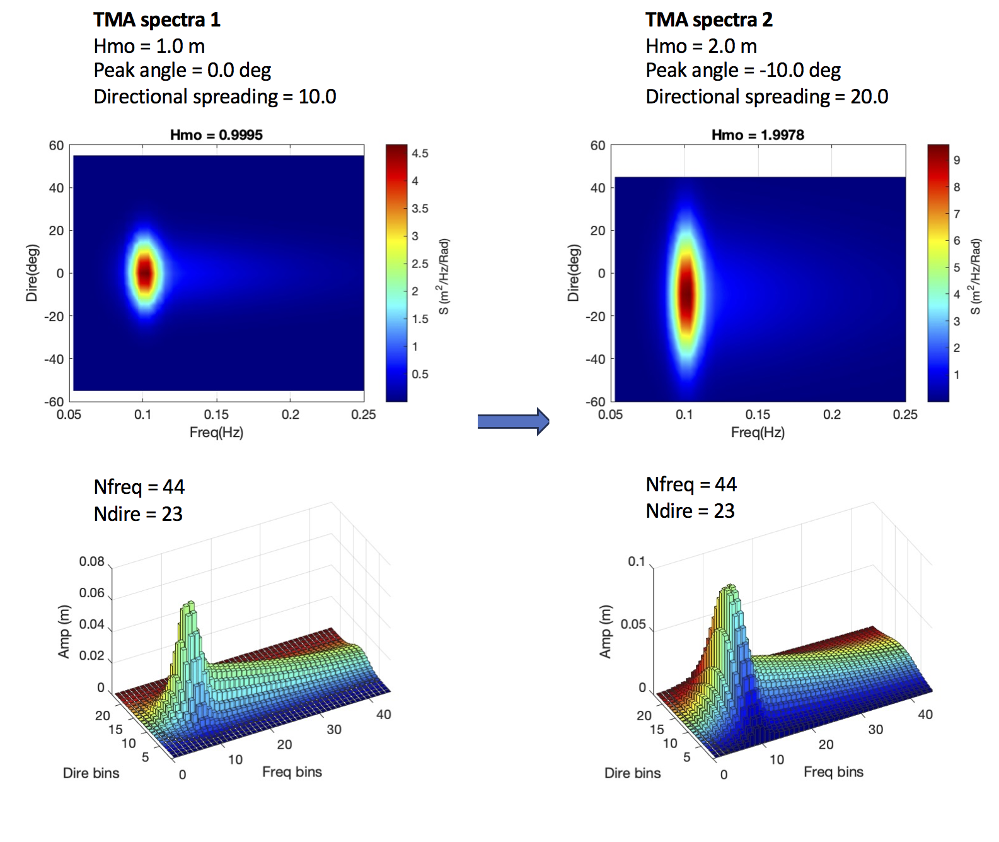

.. _section_time_spectra_module:

Time-varying Wavemaker
**************************************

The wavemaker combines the absorbing-generating boundary condition (similar to the wavemaker in the tide module) and the linear wave solutions at the WEST boundary. Users can specify a time series of spectra at the west boundary.     

============================================================
Combined tidal and absorbing-generating boundary condition
============================================================

The basic technique follows the sponge layer theory used in the tide module :ref:`section_tide_module`. Instead of attenuating the surface elevation and flow velocity to zero at the end of a sponge layer, we dampen shortwaves with respect to a reference level based on the method proposed by `Chen et al. (1999) <https://ascelibrary.org/doi/abs/10.1061/(ASCE)0733-950X(1999)125:4(176)>`_. `Zhang et al.(2014) <https://doi.org/10.1016/j.coastaleng.2013.10.019>`_ provided a detailed analysis on the numerical method. The dependent variables (:math:`\eta, u, v`) are attenuated as

.. math:: \eta_i = \eta_{ref} + (\eta_i - \eta_{ref})/C_s

.. math:: u_i = u_{ref} + (\eta_i - u_{ref})/C_s

where :math:`( )_{ref}` denotes the reference values which either tidal level or tidal current or both. :math:`C_s` is the damping coefficient which is the same as that used in a sponge layer (see sponge layer section for detail), i.e., 

.. math:: C_s = \alpha_s^{\gamma_s^{(i-1)}}

in which :math:`i` is grid numbers, (:math:`i = 1, 2, ...`). 

The combined tidal and absorbing-generating boundary condition incorporates the solution of the linear wave theory and tidal elevation and velocity in the sponge layer. 

The reference values (:math:`\eta_{ref}, u_{ref}, v_{ref}`) are tidal levels and tidal current velocities specified either in input.txt or in a separate tide/surge file. Different from the tidal absorbing boundary condition, the reference values (:math:`\eta_{ref}, u_{ref}/v_{ref}`) combine the tidal condition and wave solution, and specified over the entire computational domain. Inside the sponge layer, the differences between the reference  values :math:`( )_{ref}` and model solution :math:`( )_i` are dampened by the sponge. Outside the sponge layer, independent variables are calculated directly from the model because :math:`C_s` is 1.0. In this study, the west-side absorbing-generating boundary condition is implemented. 

============================
Time varying spectra
============================

Time-dependent wave spectra can be specified in a series of data files containing wave spectra. The files keep the same number of wave components thus that an instant wave energy in each bin can be interpolated in time. The figure below shows two TMA spectra at different times, TMA spectra 1 and TMA spectra 2, respectively. The upper panel shows 2D plots of directional spectra, and the bottom panel shows the wave amplitudes in the discrete bins. Here, the wave energy in each bin is converted to the wave amplitude for the traditional reason. Model input includes the same number of spectra bins, i.e., Nfreq = 44 and Ndire = 23. Note that the values of (Freq(i),i=1:44) and (Dire(j), j=1:23) will not change in the entire simulation. The only change in the input is the amplitude in different time. For a wave energy bin :math:`E(i,j)` the wave amplitude can be calculated by :math:`a(i,j) = \sqrt{2E(i,j)}`. 
     

An example is provided in /time\_spectra/. In input.txt, set

 .. code-block:: rest

  WAVEMAKER = TIME_SPECTRA
  SPECTRA_FILE = spectra_file.txt
  TIDAL_BC_GEN_ABS = T
  TideBcType = DATA
  TideWestFileName = tide_data_west.txt

Here, spectra_file.txt contains numbers and values of frquencies an directions, spectra data files at different times

 .. code-block:: rest

  ! file contains freq/dire bins and file names for time-dependent spectra
  ! numbers of freq  and direction bins (two integers)
  1 1 
  ! frequencies (1/s, column array)
  0.1
  ! directions (Cartesian degree, column array) 
  0.0
  ! phases (empty = 0)
  0
  ! time (s) and file name (string)
  0.0
  spectra_data_1.txt
  100.0
  spectra_data_2.txt
  200.0
  spectra_data_3.txt 

In the example, three data files are specified as spectra\_data\_1.txt, spectra\_data\_2.txt and spectra\_data\_3.txt at t = 0.0 s, 100.0 s, and 200.0 s, respectively. For each data file, wave amplitudes are specified using a 2D array with colomns for frequecy bins and rows for direction bins: 

 .. code-block:: rest

  DO J=,NumDir
    READ(Ifile,*) (AmpData(I,J),I=1,NumFreq)
  ENDDO

Tide module is used in this application. For tide setup, see tide module example :ref:`section_tide_module`. 

The following figure shows a snapshot surface elevation at 198s from the matlab script plot\_wave.m

============
References
============
Chen, Q., Madsen, P.A., Basco, D.R., 1999. “Current Effects on Nonlinear Interactions of Shallow–Water Waves”. J. of Waterway, Port, Coastal, and Ocean Eng. 125 (4).

Larsen, J. and Dancy, H., 1983. “Open boundaries in short wave simulations – A new approach”. Coastal Eng. 7 (3), 285-297. DOI: `10.1016/0378-3839(83)90022-4 <https://doi.org/10.1016/0378-3839(83)90022-4>`_.

Zhang, Y., Kennedy, A.B., Panda,N., Dawson,C., Westerink, J.J., 2014, Generating–absorbing sponge layers for phase-resolving wave models, Coastal Engineering, 84., 1-9. 