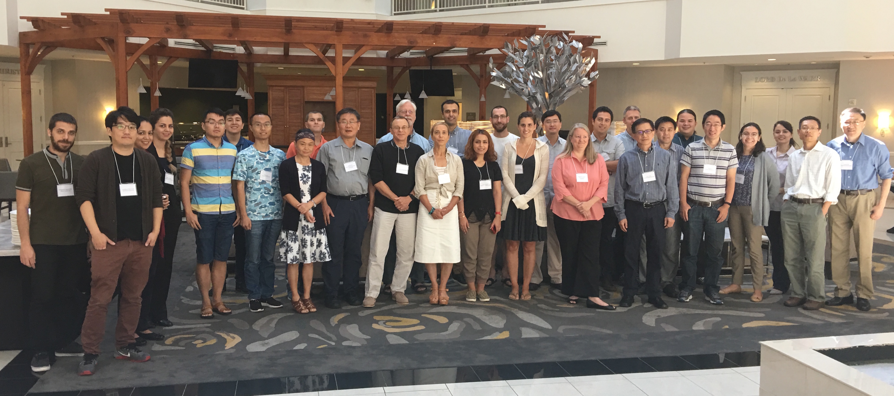

ATTENDEES
=============

* Mahsa Arabi (Stony Brook University)   
* Katherine Labuhn (Army Corps of Eng - Detroit)
* Qin J Chen (Louisiana State University)
* Drew Condon (Army Corps of Eng - Jacksonville)
* Gabriel Diaz-Hernandez (UNICAN-IHCantabria University)   
* Yumei Ding (Tianjin Univ. Sci. and Tech. )
* Celso Ferreira (George Mason University)
* Stephan Grilli (University of Rhode Island)
* Annette Grilli (University of Rhode Island)
* Kelin Hu (Louisiana State University)   
* Jim Kirby (University of Delaware)   
* Rozita Jalali Farahani(Risk Management Solutions)   
* Rozita Kian (TAMU)
* Michael Lam (Army Corps of Eng, CHL)   
* Jonghyun Harry Lee (Stanford Univ.)
* Kelly Legault (Army Corps of Eng - Jacksoville)
* Arslaan Khalid(George Mason University)
* Wenwen Li (AECOM)   
* Matt Malej (Army Corps of Eng, CHL)    
* Rachel Malburg (Army Corps of Eng - Detroit)
* Fatima Nemati (University of Rhode Island)
* Fernando Salazar Monroy (National Autonomous University of Mexico)  
* Gabriela Salgado-Dominguez (CHL - USACE)
* Lauren Schambach (University of Rhode Island)
* Seungnam Seo (Korea Institue of Ocean Science and Technology)   
* Fengyan Shi (University of Delaware)    
* Navid Tahvildari (Old Dominion University)   
* Nigel Tozer (HR Wallingford)   
* Panagiotis Vasarmidis (Uhent University) 
* Gregory Westcott (University of Rhode Island)  
* India Woodruff (University of Delaware)
* Long Xu (Woods Hole Group) 
* Yilang Xu (Stanford Univ.)  
* Shouxian Zhu (Hohai Univ.)   
* Shan Zou (ARCADIS)    
