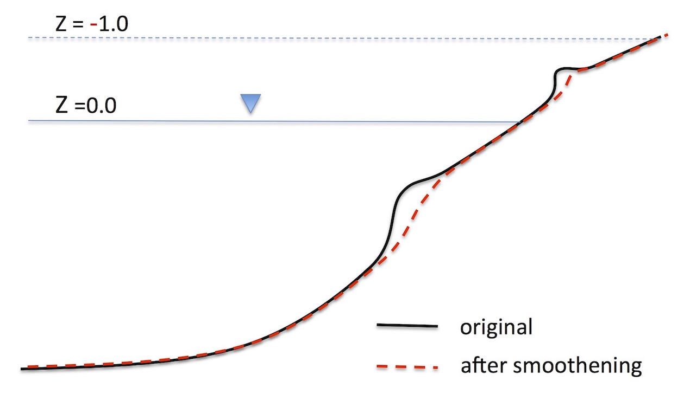

.. _bathymetry_correction:

Bathymetry Correction
***********************

Large bathymetric slopes may induce computational errors in Boussinesq models. They can even  cause numerical instabilities for a case with bathymetry containing a large amount of big slope points (slope > 1.0). In this case, you should smoothen the bathymetry or use the following option in *input.txt*::

  BATHY_CORRECTION = T

  SmoothBelowDepth = -1.0 #(for example)

  SlopeCap = 1.0  #(for example)

where *SmoothBelowDepth*  defines the depth at which the smoothening process will begin. Negative numbers designate depths above the still water level (i.e., land/shore). Therefore *SmoothBelowDepth = --1.0* means that the smoothening process will occur from --1.0 m (1.0 m above the still water level) to the sea bed (see figure below). 

The *SlopeCap* variable defines the slope at which the smoothening process will occur. In other words, *SlopeCap  = 1.0* means that areas where slope > 1.0 will be smoothed. 

