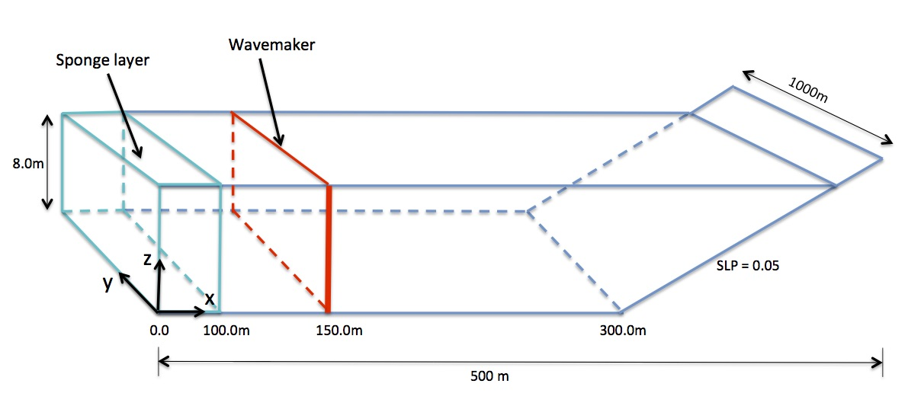

.. _section-beach-2d-basics:

Basics for model setup
######################

In the directory :code:`/simple_cases/beach_2d/input_files/`, you will find multiple instances of input files that are specific to different variations of this example, e.g., regular ("input\_reg.txt) versus irregular ("input\_irr.txt") wavemaker configuration. It should be noted that the model will accept only the file named "input.txt". Therefore, if you want to switch wavemaker cases, you will need to modify the primary "input.txt" file.

**Computational domain**

**Setup in "input.txt"**

See an example of a complete "input.txt" :ref:`here <section-definitions>`.

For this example, you will set the following in "input.txt". **Remember that all parameters are case sensitive**.

  If running in parallel, set the number of processors in X and Y:

  .. code-block:: rest

        !-----PARALLEL INFO-----
         PX = 2
         PY = 1 

  Set the bathymetry to match the figure above:

  .. code-block:: rest

        !-----DEPTH-----
         DEPTH_TYPE = SLOPE
         DEPTH_FLAT = 8.0
         SLP = 0.05
         Xslp = 300.0

  (refer to :ref:`definition_grid` for parameter descriptions)

  Send the results to a folder named "output":

  .. code-block:: rest

        !-----PRINT-----
         RESULT_FOLDER = output/
  
  Set the dimensions of the domain to 500 x 250 (x and y directions, respectively):

  .. code-block:: rest
        
        !-----DIMENSION-----
        
         Mglob = 500    ! x-dir
         Nglob = 250    ! y-dir

  Set the total computational time, plot time, and screen interval to 200.0 s, 2.0 s, and 2.0 s, respectively:

  .. code-block:: rest

        !-----TIME-----
         TOTAL_TIME = 200.0
         PLOT_INTV = 2.0
         SCREEN_INTV = 2.0

  Set the grid spacing in x and y to 2.0 m:

  .. code-block:: rest

        !-----GRID-----
         DX = 2.0
         DY = 2.0
  
  For starters, add a wavemaker for a monochromatic wave with normal incidence:

  .. code-block:: rest

        !-----WAVEMAKER-----
         WAVEMAKER = WK_REG
         DEP_WK = 8.0
         Xc_WK = 150.0
         Yc_WK = 0.0
         Tperiod = 8.0
         AMP_WK = 0.5
         Theta_WK = 0.0
         Delta_WK = 3.0

  To change the incident wave angle to 30 degrees, modify the :code:`Theta_WK` parameter to 30.0. This will apply for the wavemaker cases listed below. Refer to :ref:`definition_wavemaker` for parameter definitions.
         
  Set the periodic boundary condition to TRUE:

  .. code-block:: rest

        !-----PERIODIC BOUNDARY CONDITION-----
         PERIODIC = T

  (refer to :ref:`info_periodic` for an example)

  Set the sponge layer width to 100.0 m on the left boundary:

  .. code-block:: rest

        !-----SPONGE LAYER-----
         DIFFUSION_SPONGE = F
         FRICTION_SPONGE = T
         DIRECT_SPONGE = T
         Csp = 0.0
         CDsponge = 1.0
         Sponge_west_width = 100.0      ! this line
         Sponge_east_width = 0.0
         Sponge_south_width = 0.0
         Sponge_north_width = 0.0

  (refer to :ref:`info_sponge` for example of 2D sponge case)

  **Keep the default values** for the :code:`PHYSICS, NUMERICS, WET-DRY,` and :code:`BREAKING` sections. Refer to :ref:`section-definitions` for a description of all parameters.

  Set the wave average properties to 100.0 s:

  .. code-block:: rest

        !-----WAVE AVERAGE-----
         T_INTV_mean = 100.0
         STEADY_TIME = 100.0

  Set the following output files to TRUE:

  .. code-block:: rest

        !-----OUTPUT-----
         DEPTH_OUT = T
         ETA = T
         Umean = T
         Vmean = T
         ETAmean = T
         MASK = T
         WaveHeight = T

  (refer to :ref:`definition_output` for parameter definitions)

  
Several "input.txt" files are located in the folder :code:`/simple_cases/beach_2d/input_files/` listing wavemaker parameters for different cases. When running one of the cases listed below, copy the wavemaker parameters from the respective file to the primary "input.txt" file:

  * Case 1: monochromatic wave with normal incidence -- "input_reg.txt"

  * Case 2: monochromatic wave with 30-degree incidence -- "input_reg_30deg.txt"

  * Case 3: irregular waves with peak direction = 0.0 -- "input_irr.txt"

  * Case 4: irregular waves with peak direction = 30.0 -- "input_irr_30deg.txt"

**Postprocessing**

  For postprocessing examples, MATLAB and Python scripts are located in :code:`/simple_cases/beach_2d/postprocessing/`.
