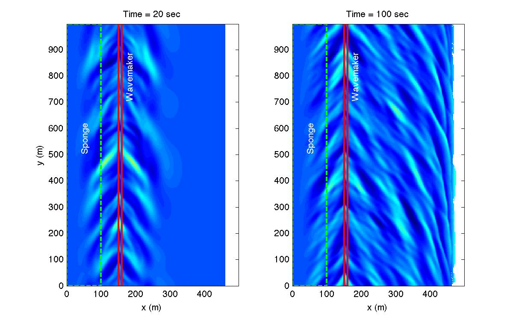

.. _section-beach-2d-irregular:

Irregular wave 30 deg oblique incidence
########################################

The following sections will be modified in "input.txt" for this case. All other sections are defined in :ref:`section-beach-2d-basics` for this example.

  Set a descriptive title for your simulation:

  .. code-block:: rest

        !-----TITLE-----
         TITLE = 2D_beach_irregular_30deg

  Modify the wavemaker to generate an irregular TMA wave spectrum with (or without) incidence of 30 degrees:
  
  .. code-block:: rest
       
       !-----WAVEMAKER-----

        WAVEMAKER = WK_IRR
        DEP_WK = 8.0 
        Xc_WK = 150.0 
        Yc_WK = 0.0 
        FreqPeak = 0.0833 
        FreqMin = 0.05
        FreqMax = 0.3 
        Hmo = 1.0 
        GammaTMA = 5.0 
        ThetaPeak = 30.0        ! or ThetaPeak = 0.0 for normal incidence
        Sigma_Theta = 10.0 

  Default option for energy splitting: EqualEnergy (refer to :ref:`info_equal_energy` for more information).

  Refer to :ref:`definition_wavemaker` for parameter definitions.

