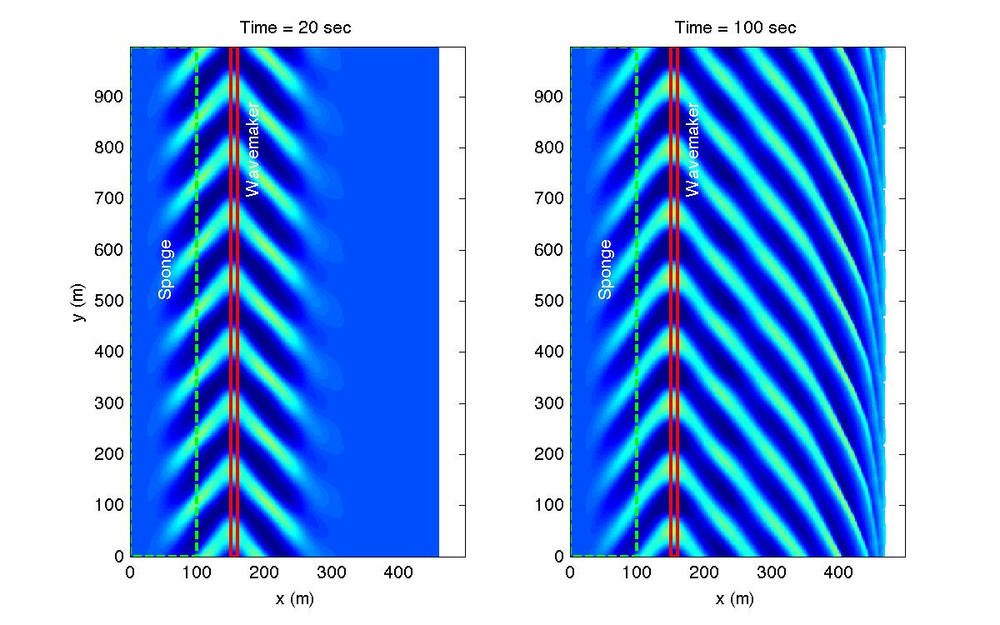

Regular wave 30 deg oblique incidence
#####################################

In *input.txt*, update the following variables:

**Slope bed**
  .. code-block:: rest
       
       DEPTH_TYPE = SLOPE 
       DEPTH_FLAT = 8.0
       SLP = 0.05
       Xslp = 300.0

  (refer to :ref:`definition_grid`)

**Output folder**
  .. code-block:: rest
       
       RESULT_FOLDER = output/ 

**Dimensions**
  .. code-block:: rest
       
       Mglob = 250
       Nglob = 500 

**Grid sizes**
  .. code-block:: rest
       
       DX = 2.0 
       DY = 2.0 

**Add wavemaker**
  .. code-block:: rest
       
       WAVEMAKER = WK_REG
       DEP_WK = 8.0 
       Xc_WK = 150.0 
       Yc_WK = 0.0 
       Tperiod = 8.0 
       AMP_WK = 0.5 
       Theta_WK = 30.0 
       Delta_WK = 3.0

  (refer to :ref:`definition_wavemaker`)

**Add periodic boundary condition**
  .. code-block:: rest
       
       PERIODIC = T  
       
  (refer to :ref:`info_periodic`)

**Sponge layer**
  .. code-block:: rest
       
       DIFFUSION_SPONGE = F 
       FRICTION_SPONGE = T 
       DIRECT_SPONGE = T 
       Csp = 0.0 
       CDsponge = 1.0 
       Sponge_west_width =  100.0 
       Sponge_east_width =  0.0 
       Sponge_south_width = 0.0 
       Sponge_north_width = 0.0 

  (refer to :ref:`info_sponge`)

**Wave breaking**
  .. code-block:: rest
        
       VISCOSITY_BREAKING = T  
       Cbrk1 = 0.65 
       Cbrk2 = 0.35 

  (refer to :ref:`example_breaking`)

**Wave average property**
  .. code-block:: rest
       
       T_INTV_mean = 100.0 
       STEADY_TIME = 100.0 

**Output**
  .. code-block:: rest
       
       ETA = T 
       Umean = T 
       Vmean = T 
       ETAmean = T 
       MASK = T
       WaveHeight = T

  (refer to :ref:`definition_output`)

