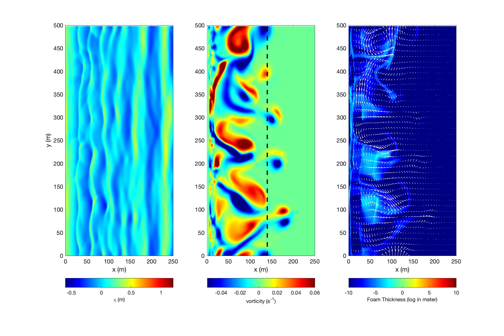

.. _section_tide_module:

Bubble and Foam Module
**************************

====================
Theory
====================

Bubble entrainment, foam tranfer rate and burst rate are formulated based on emperical formulas developed in the previous study. Details will be documented later (Malej et al. 2023, in preparation). 

=================================================================
Model configuration and input
=================================================================

1) Modify Makefile with -DFOAM

2) Specify parameters related to bubble and foam entrainments, etc.

 .. code-block:: rest
 
  PLOT_INTV_FOAM = <float number> (default: same as PLOT_INTV) 
  BurstRate = <float number> (default: 0.01)
  MinThick = <float number> (default: 0.01)
  TransferRate = <float number> (default: 0.1)
  CdFoam = <float number> (default: 0.5)

3) An example is provided In /rip\_2D\_foam/.  The figure below shows the model result from default parameters. 

==============================================================
More information
==============================================================

List of parameters for tidal module setup can be found `here <https://fengyanshi.github.io/build/html/tide_surge.html>`_

============
References
============

Malej et al. (2023), in preparation
