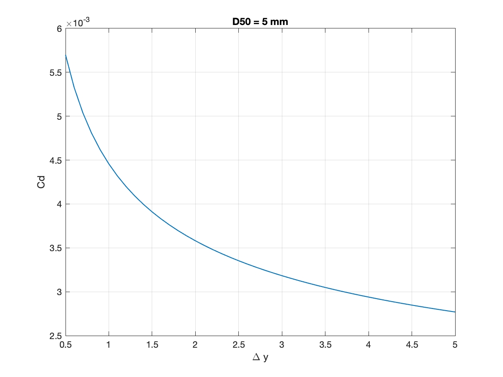
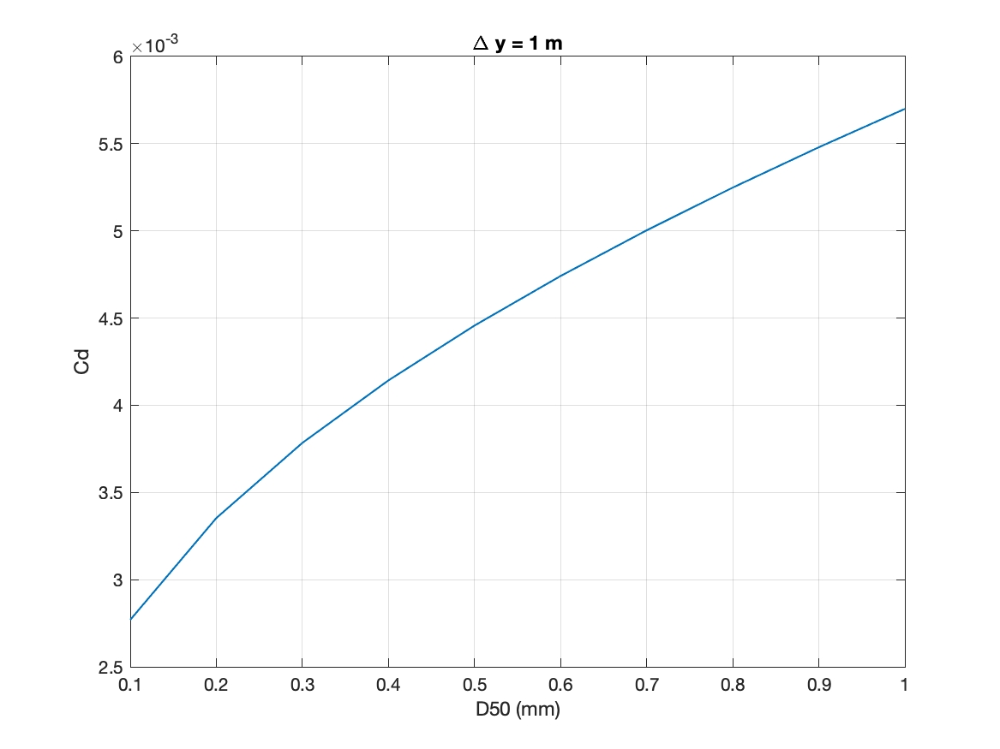

.. _section_central_module:

*******************
Central Module
*******************

The central module solves the Boussinesq equations and also takes care basic functions such as wavemaker, wave breaking, spongelayers, boundary conditions and model input and output.

Visit each of the following pages to learn more about the theory of these features:

.. toctree::
   :maxdepth: 1

   wavebreaking
   spongelayer
   wavemaker

Boundary Conditions
===================

**Wall boundary condition**
     A mirror boundary condition is used for a fully reflective wall.

**Periodic boundary condition**
     The periodic boundary condition in *y* (south/north) direction was implemented in the code.

**Lateral frictional boundary condition**
The lateral frictional boundary condition applied to "coarsely" resolved ocean models was discussed in `Deremble et al. (2011) <https://www.ma.imperial.ac.uk/~pberloff/OM_deremble_et_al_2011.pdf>`_. Following this idea, the lateral mixing terms in FUNWAVE-TVD can be expressed in the equations below

.. math:: {\bf M}_t + \nabla \cdot \left( \frac{{\bf MM}}{H} \right) + \nabla \left(\frac{1}{2}g(\eta^2 + 2h\eta) \right) = H {\bf V}_{dis} + g\eta \nabla h + H \nabla \cdot \vec{\tau} 

where :math:`\vec{\tau} = (\tau_x, \tau_y)` represents the lateral shear stress. We use the Law of the Wall where the molecular processes are the dominant mechnisc in a frictional sublayer at Kolmogorov scales. Outside this layer, viscosity becomes unimportant. The scaling arguments based on the free stream flow lead to 

.. math:: u_y = \frac{u_*}{\kappa y}

where :math:`u` is teh along-wall flow velocity (velocity in x-direction, for example), :math:`y` is the distance from the wall, :math:`\kappa \sim 0.4` is the von Karman constant, :math:`u_*` is friction velocity, and :math:`k_s` denotes a roughness length. The solution of the equation above is

.. math:: u(y) = \frac{u_*}{\kappa} \ln \left( \frac{y}{k_s} \right) 

The shear stress at the computational grid mostly close to the wall can be expressed as

.. math:: \tau_x|_{y=\Delta y} = \frac{(u \kappa)^2}{[\ln(\frac{\Delta y}{2 k_s})]^2} sgn(u) 

where :math:`\Delta y` is the grid size, and note that the distance from the grid cell center to the wall is :math:`\Delta y / 2` for the FV grid used in FUNWAVE-TVD, :math:`sgn` represents the sign factor. A similar expression can be derived for shear stress in y-direction at the wall perpendicular to x-direciton,

.. math:: \tau_y|_{x=\Delta x} = \frac{(v \kappa)^2}{[\ln(\frac{\Delta x}{2 k_s})]^2} sgn(v) 

It is a general practice in the oceanographic and meteorological fields to introduce a drag coefficient :math:`C_d` relating the stress to the velocity at some "standard" (Deremble et al., 2011) distance, for example, for wind-induced stress at the ocean surface, 10 m above the sea surface can be adopted as a standard distance used to parameterize the shear stress in air-sea momentum flux. :math:`C_d` is in the range of :math:`1-3 \times 10^{-3}`. 

In our case, the shear stress above can also be parameterized as

.. math:: \tau_x |_{y=\Delta y} = C_d^x u^2 sgn(u)

.. math:: \tau_y |_{x=\Delta x} = C_d^y v^2 sgn(v) 

where :math:`C_d^x =\frac{\kappa^2}{[\ln(\frac{\Delta y}{2 k_s})]^2}` and :math:`C_d^y =\frac{\kappa^2}{[\ln(\frac{\Delta x}{2 k_s})]^2}`, noting that :math:`C_d^x = C_d^y` if :math:`\Delta x = \Delta y`, which is a regular case in FUNWAVE-TVD applications. The figures below show the range of :math:`C_d` in different roughness length :math:`k_s = 2.5 D50` and grid sizes. 

