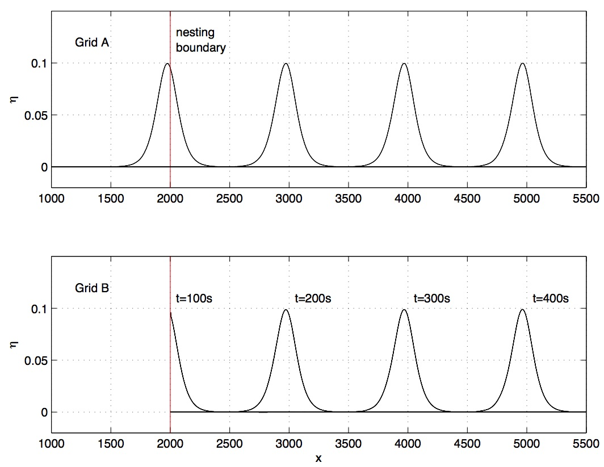

.. _example-coupling_sph:

Coupling grid A and B
#######################################

.. toctree::
   :maxdepth: 2

   coupling_sph_compile
   coupling_sph_procedure
   coupling_sph_solitary_a
   coupling_sph_coupling_file
   coupling_sph_solitary_b