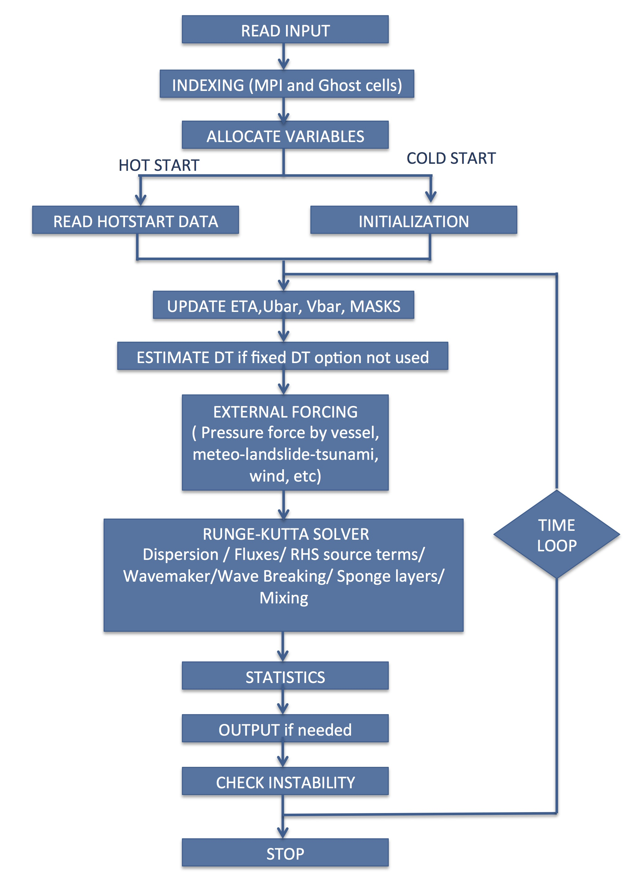
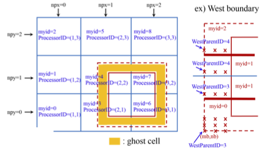

**ARCHITECTURE**
================

***************
Parallelization
***************

In parallelizing the computational model, we used a domain decomposition technique to subdivide the problem into multiple regions and assign each subdomain to a separate processor core. Each subdomain region contains an overlapping area of ghost cells,  three-row deep, as required by the fourth order MUSCL-TVD scheme. The Message Passing Interface (MPI) with non-blocking communication is used to exchange  data in the overlapping region between neighboring processors.  Velocity components are obtained by solving tridiagonal matrices using the parallel pipelining tridiagonal solver described in `Naik et al. (1993) <https://ieeexplore.ieee.org/abstract/document/1263540>`_. 

**********
Flow chart
**********

.. figure:: images/modules/sediment_chart_dark.png
    :width: 325px
    :align: center
    :height: 225px
    :alt: alternate text
    :figclass: align-center

******************
Nesting structure
******************

