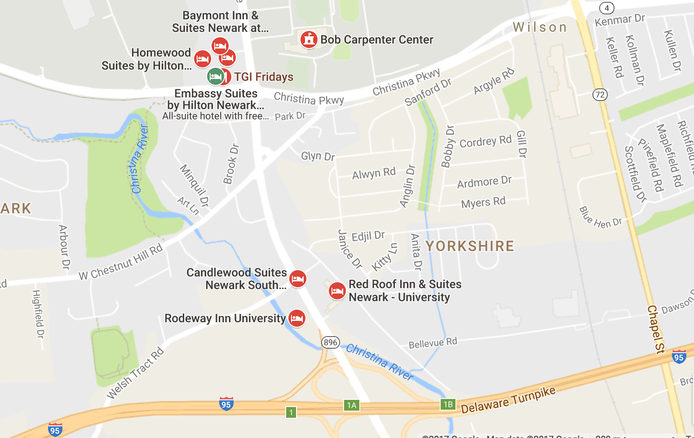

HOTELS
============

* We have a block of rooms in Embassy Suites Newark at the rate of $127+tax. Please visit the following web site or call (302) 391 5106 to make a reservation. 

`Embassy Suites website for the workshop <http://embassysuites.hilton.com/en/es/groups/personalized/N/NEWDEES-FWW-20180724/index.jhtml?WT.mc_id=POG>`_

 Group Name: FUNWAVE Workshop 2018

 Group Code: FWW

 Check-in: 24-JUL-2018

 Check-out: 27-JUL-2018

 Hotel Name: Embassy Suites by Hilton Newark Wilmington South

 Hotel Address: 654 South College Avenue, Newark, Delaware 19713

 Phone Number: (302) 391 5106

* Other hotels nearby

`BAYMONT INN AND SUITES NEWARK (0.0 miles from Embassy Suites) <https://www.wyndhamhotels.com/baymont/newark-delaware/baymont-inn-and-suites-newark-at-university-of-delaware/overview>`_

`HOMEWOOD SUITES NEWARK (0.0 miles from Embassy Suites) <http://homewoodsuites3.hilton.com/en/hotels/delaware/homewood-suites-by-hilton-newark-wilmington-south-area-NEWHWHW/index.html>`_

`RED ROOF INN AND SUITES NEWARK (0.6 miles from Embassy Suites) <https://www.redroof.com/property/DE/Newark/RRI812>`_

`RODEWAY INN UNIVERSITY (0.6 miles from Embassy Suites) <https://www.choicehotels.com/delaware/newark/rodeway-inn-hotels/de008?source=gyxt>`_

`CANDELWOOD SUITES (0.6 miles from Embassy Suites) <https://www.ihg.com/candlewood/hotels/us/en/newark/ilgcw/hoteldetail?cm_mmc=GoogleMaps-_-CW-_-USA-_-ILGCW>`_

