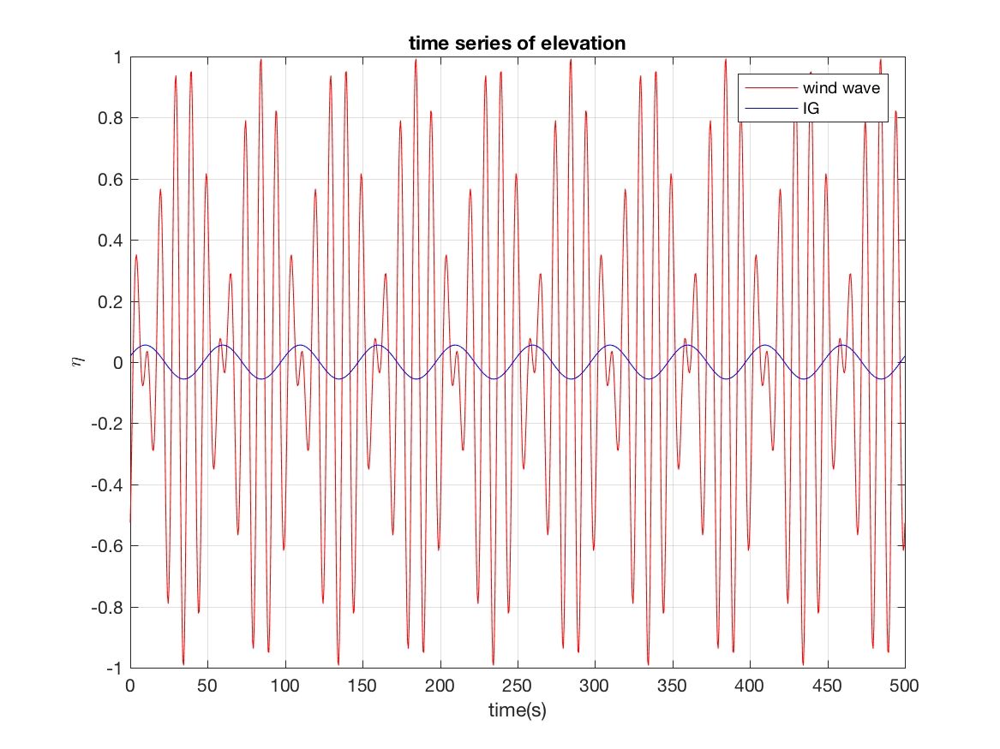

Example of IG wave generation with two wave components 
########################################################

1) Prepare four files containing wave parameters of two wave components

 *  SPC_dep_pf.txt: contains depth and peak frequency

 .. code-block:: rest

    13.0 - depth
    0.1  - peak frequency

 *  SPC_frq.txt:    contains frequency components

 .. code-block:: rest

    0.09
    0.11

 *  SPC_angle.txt:  contains wave angle (single angle)

 .. code-block:: rest

    0.0

 *  SPC_HMO.txt:    contains Hmo of wave components (note: not amplitude)

 .. code-block:: rest

    1.4142
    1.4142

    Note: 1.4142 is Hmo for a wave amplitude of 0.5m 

2) Run matlab script IG\_wave\_generation.m

   output file: spectrum\_two\_components.txt will be used in input.txt

3) Modify input.txt

 .. code-block:: rest

  WAVEMAKER = LEFT_BC_IRR
  WAVE_DATA_TYPE=DATA
  WaveCompFile = spectrum_two_components.tx
  DEP_WK = 13.0

 
