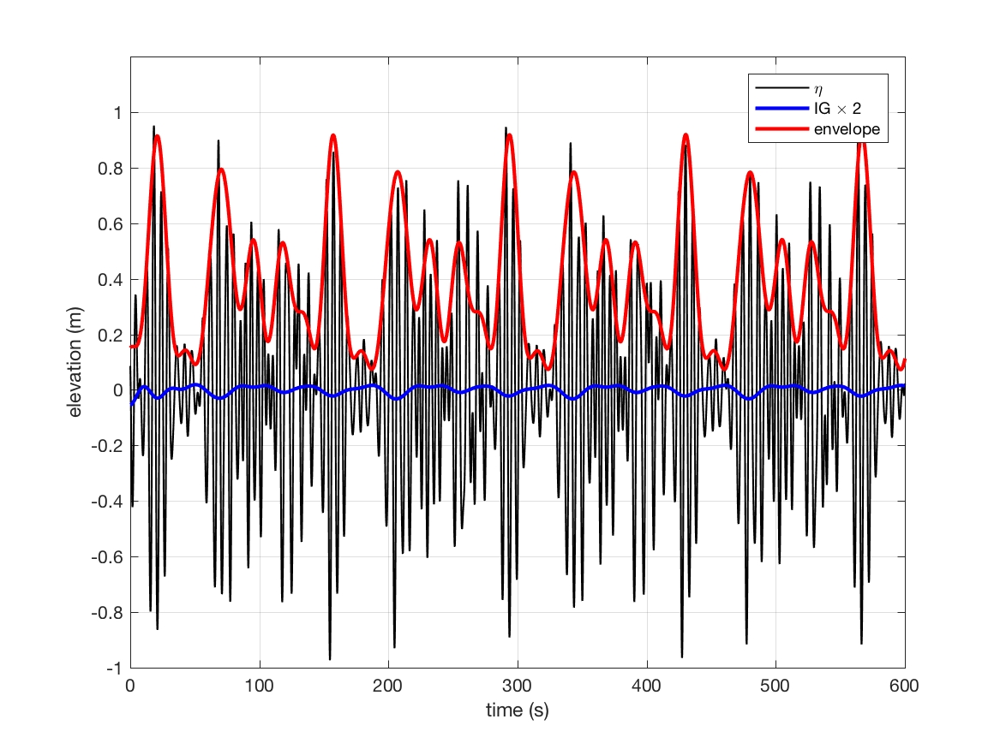
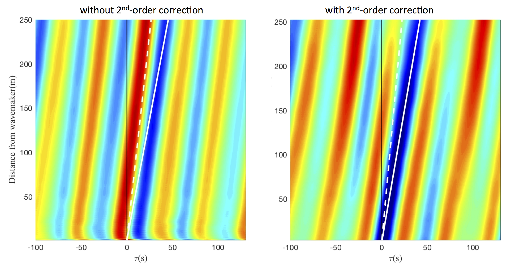

Example of IG wave generation from measured data 
########################################################

    Note, IG component is multiplied by 2 to show its correlation with groups 

1) Run matlab script, Step\_1\_read\_write\_spec.m

 * input file: input\_data\_case1.txt

 * output files: 

   SPC_dep_pf.txt: contains depth and peak frequency

   SPC_frq.txt:    contains frequency components

   SPC_angle.txt:  contains wave angle (single angle)

   SPC_HMO.txt:    contains Hmo of wave components (note: not amplitude)

2) Run matlab script Step\_2\_IG\_wave.m

   output file: spectrum\_random\_phase.txt which will be used in input.txt. The "random phase" here means random phases are used in windwave components. The phases for IG components are calculated using Hasselmann (1962). 

3) Modify input.txt

 .. code-block:: rest

  WAVEMAKER = LEFT_BC_IRR
  WAVE_DATA_TYPE=DATA
  WaveCompFile = spectrum_random_phase.tx
  DEP_WK = 13.0

 The following figure shows the correction between wave envelope and IG wave without (left) and with (right) the 2nd-order correction.   

