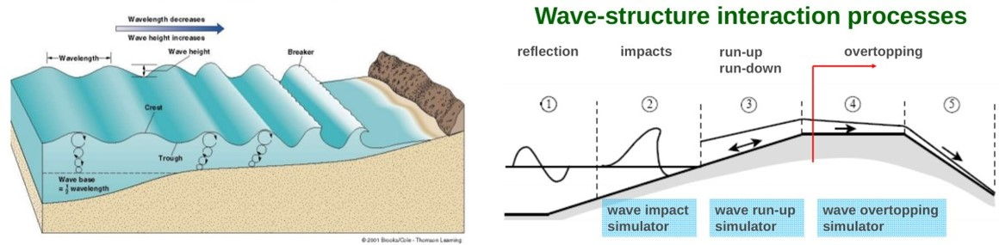

.. funwave documentation master file, created by
   sphinx-quickstart on Fri Apr 14 11:58:54 2017.
   You can adapt this file completely to your liking, but it should at least
   contain the root `toctree` directive.

.. role:: raw-html(raw)
   :format: html

============
FUNWAVE-TVD
============
.. image:: images/coverimage.jpg
   :width: 800px
   :height: 300px
   :align: left

What is FUNWAVE?
*******************
FUNWAVE--TVD is the Total Variation Diminishing (TVD) version of the fully nonlinear Boussinesq wave model (FUNWAVE) initially developed by `Kirby et al. (1998) <http://resolver.tudelft.nl/uuid:d79bba08-8d35-47e2-b901-881c86985ce4>`_. The development of the present version was motivated by recent needs for modeling of surfzone--scale optical properties in a Boussinesq model framework, and  modeling of Tsunami waves in both a regional/coastal scale for prediction of coastal inundation and a basin scale for wave propagation.

This version  features  several theoretical and numerical improvements, including:

1. A more complete set of fully nonlinear Boussinesq equations; 
2. Monotonic Upwind Scheme for Conservation Laws (MUSCL)--TVD solver with adaptive Runge--Kutta time stepping; 
3. Shock--capturing wave breaking scheme; 
4. Wetting--drying moving boundary condition with incorporation of Harten-Lax-van Leer (HLL) construction method into the scheme; 
5. Option for parallel computation. 

The most recent developments include ship-wake generation (`Shi et al., 2018 <https://www.sciencedirect.com/science/article/pii/S0378383917304246>`_), meteo-tsunami generation (`Woodruff et al., 2018 <https://icce-ojs-tamu.tdl.org/icce/index.php/icce/article/view/8470>`_), and sediment transport and morphological changes (`Malej et al., 2019 <https://apps.dtic.mil/dtic/tr/fulltext/u2/1074624.pdf>`_).

This Wiki page provides general introductions to all model components and theory behind the numerical formulations, simple examples and tutorials for beginners, and download and installation instructions to begin using FUNWAVE--TVD locally. The detailed model equations and numerical schemes can be found in `Shi et al. (2012) <http://www.sciencedirect.com/science/article/pii/S1463500311002010>`_.

For quick keyword searches, use the search bar to the right.

********************

=============
Capabilities
=============

As a nearshore shallow-to-intermediate water phase-resolving Boussinesq-type numerical wave model, FUNWAVE can resolve many coastal processes such as:

.. sidebar:: **Exclusive to phase-resolving**

   Coastal processes highlighted in bold indicate process-based capabilities that are *not* naturally resolved in *phase-averaging* wave models. These features are exclusive to *phase-resolving* wave models.

* Nearshore wave propagation & transformation
* Refraction, **diffraction** & nonlinear shoaling
* Bottom friction & wave-induced currents
* Nonlinear wave--wave & wave--current interactions
* Wave breaking with **runup** & **overtopping**
* **Partially absorbing/reflecting** inner boundaries
* **Harbor resonance** & **Infragravity (IG) waves**
* **Vessel--generated waves** & related sediment transport with morphology change
* Adaptive mesh refinement (AMR) module for refined moving and two--wave coupled grids

Applications
************

Transition to HPC-Portal
************************

************************

==========
Subscribe
==========

************************

=========
Contents
=========
.. toctree::
   :maxdepth: 2

   basics
   flowchart
   setup
   definition
   coupling_nesting
   examples
   gallery
   news
   references
   authors
   addition

.. raw:: html
   :file: google_group.html

Indices and tables
******************

* :ref:`genindex`
* :ref:`modindex`
* :ref:`search`
