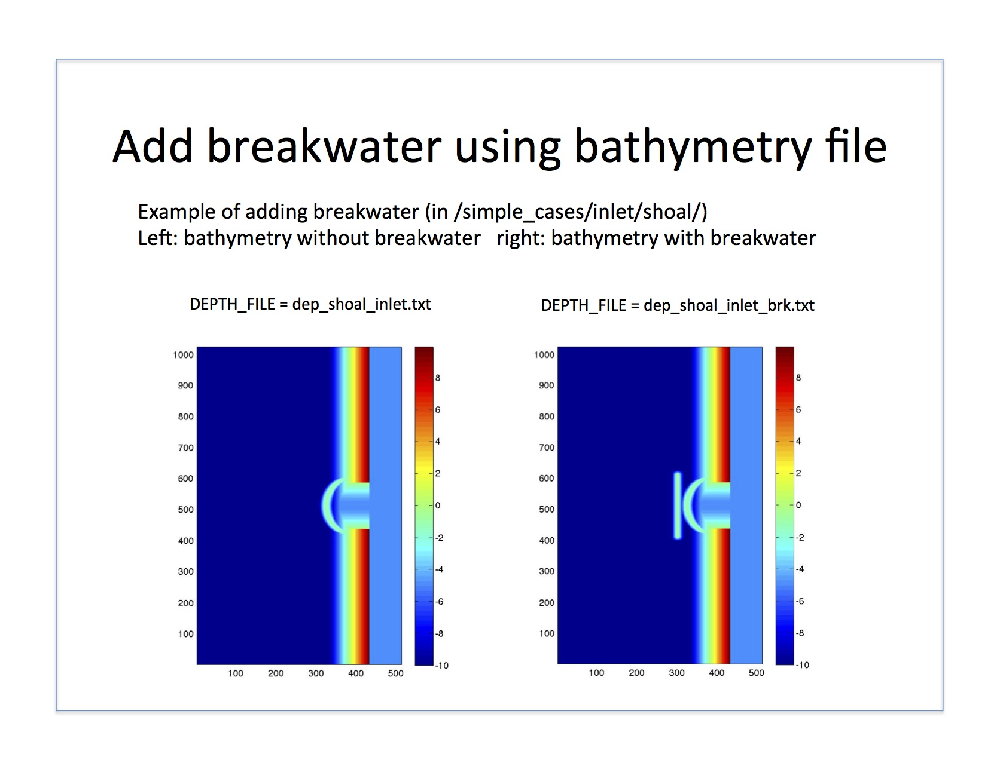

.. _example_bathy_breakwater:

Example: add breakwater using bathymetry file
**************************************************

For model setup, refer to the ``Specification of Water Depth`` section on the :ref:`definition_grid` page.

