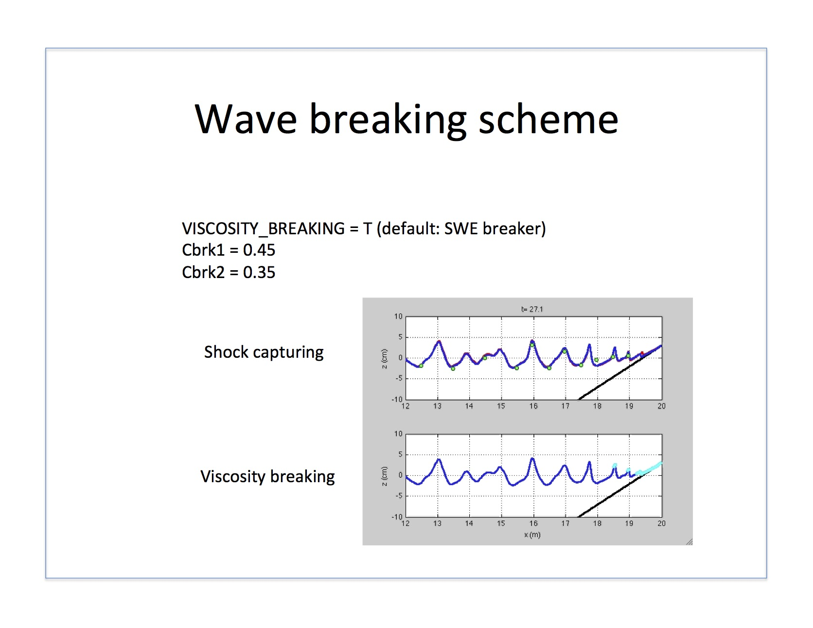

.. _example_breaking:

Example: Breaking
********************

model setup refer to :ref:`section-physics`

* animation: Mase and Kirby, VIS breaker vs. SWE breaker

.. raw:: html

  <iframe width="560" height="315" src="https://www.youtube.com/embed/9ibTRPqXgew?rel=0" frameborder="0" allowfullscreen></iframe>

