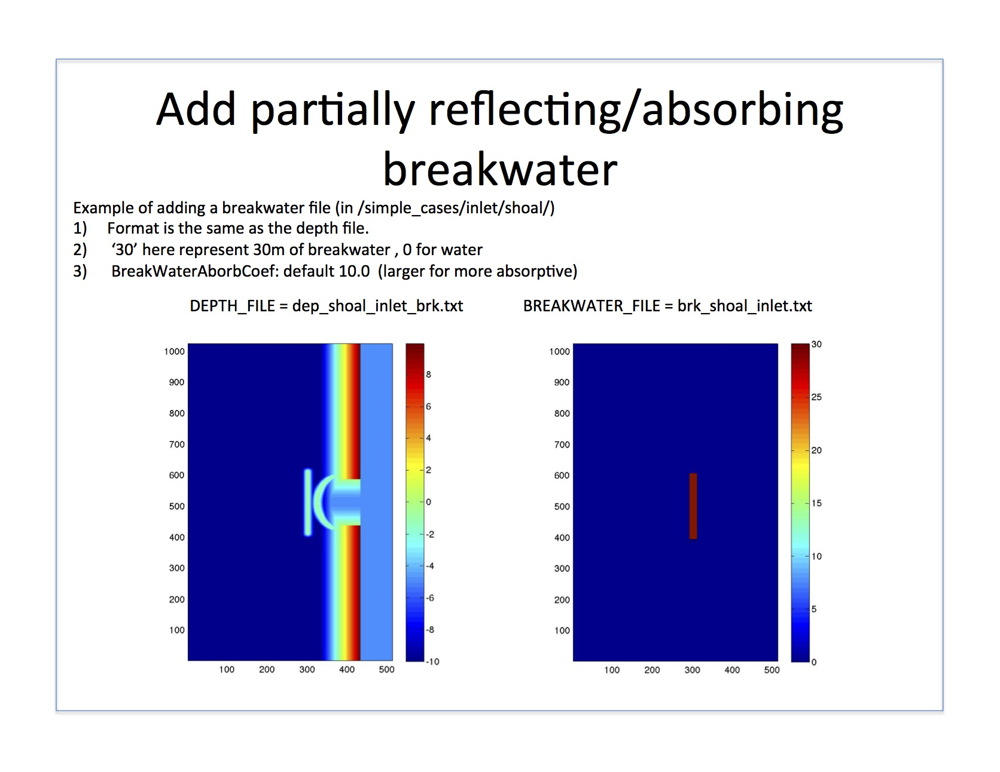

.. _example_partial_breakwater:

Example: add partially reflecting/absorbing breakwater
**********************************************************

model setup refer to :ref:`definition_breakwater`

