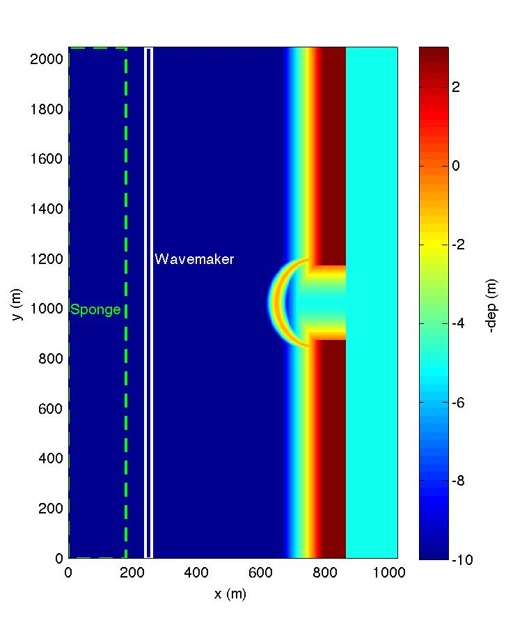

Basics for model setup
##########################

* computational domain

Basic info

 Dimensions 512 X 1024

 DX = DY = 2.0 m

 Wavemaker located at x = 250.0 m

 Sponge layer: x = 0.0 -- 180.0 m

* input.txt
  several input files in the folder /simple_cases/inlet_shoal/input_files/ for different cases. When run a case, copy one of them to "input.txt"

  input_reg.txt -- monochromatic wave, normal incidence

  input_reg_30deg.txt -- monochromatic wave, 30-degree incidence

  input_irr.txt -- irregular waves, peak direction - 0.0 

  input_irr_30deg.txt -- irregular waves, peak direction - 30.0 

  input_irr_30deg_obs.txt -- irregular waves, peak direction - 30.0, plus an obstacle (breakwater)

  input_irr_30deg_brkwtr.txt -- irregular waves, peak direction - 30.0, plus submerged breakwater with partial reflection (full reflection if removing breakwater file (brk_shoal_inlet.txt) in the input file)

* Bathymetry files

  in the folder /simple_cases/bathy/

  dep_shoal_inlet.txt  -- basic bathymetry

  dep_shoal_inlet_brk.txt  -- bathymetry with a breakwater geometry

.. NOTE::
   Option: Bathymetry Correction. 
   visit :ref:`bathymetry_correction`.
  
* breakwater file

  brk_shoal_inlet.txt -- same i/o format as bathymetry file but only contains breakwater width info

* obstacle file

  obs_shoal_inlet.txt -- same i/o format as bathymetry file but only contains 0/1 with 0 indicating an obstacle point

* postprocessing

  matlab examples of postprocessing are located in /simple_cases/inlet_shoal/postprocessing/

