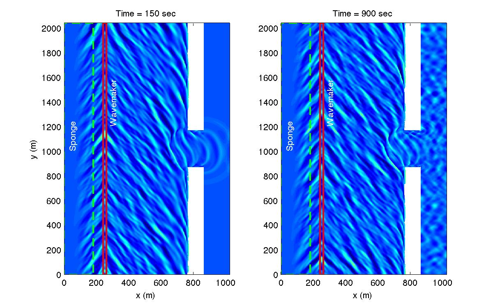

.. _section-inlet-irr30:

Irregular waves with 30 deg oblique incidence
#############################################

Update the incident wave angle of the irregular wavemaker in "input.txt" for this example. Refer to :ref:`section-inlet-basics` for domain setup.

 Set descriptive title for your simulation:

 .. code-block:: rest

        !-----TITLE-----
         TITLE = inlet_irr_30deg

 Set the incident wave angle to 30 deg:

 .. code-block:: rest

        !-----WAVEMAKER-----
         WAVEMAKER = WK_IRR
         DEP_WK = 10.0
         Xc_WK = 250.0
         Yc_WK = 0.0
         Ywidth_WK = 20000.0
         FreqPeak = 0.0893
         FreqMin = 0.03
         FreqMax = 0.3
         Hmo = 1.00
         GammaTMA = 3.3
         ThetaPeak = 30.0      ! here
         Sigma_Theta = 10.0

 Default option for energy splitting is EqualEnergy (refer to :ref:`info_equal_energy` for more information). Refer to :ref:`definition_wavemaker` for parameter definitions.

