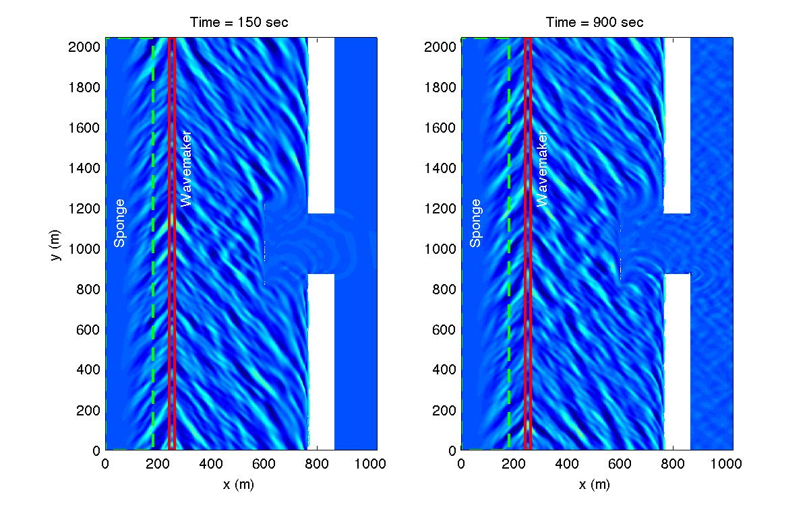

.. _section-inlet-irr30-brk-ref:

30 deg irregular waves, a submerged breakwater with partial reflection
#######################################################################

Continue to build on :ref:`section-inlet-irr30-brk` by adding a partially reflecting breakwater to the simulation. Refer to :ref:`section-inlet-basics` for domain setup.

 Set descriptive title for your simulation:

 .. code-block:: rest

        !-----TITLE-----
         TITLE = inlet_irr_30deg_brk_ref

 Keep the :code:`DEPTH_FILE` the same as in :ref:`section-inlet-irr30-brk`, and add a :code:`BREAKWATER_FILE` to define the partially reflecting breakwater:

 .. code-block:: rest

        !-----DEPTH-----
         DEPTH_TYPE = DATA
         DEPTH_FILE = DEPTH_FILE = dep_shoal_inlet_brk.txt

         BREAKWATER_FILE = brk_shoal_inlet.txt

 "brk_shoal_inlet.txt" has the same format as the depth file, and the values represent the damping width (like a sponge layer).

 Refer to :ref:`example_partial_breakwater` for more information.

  

