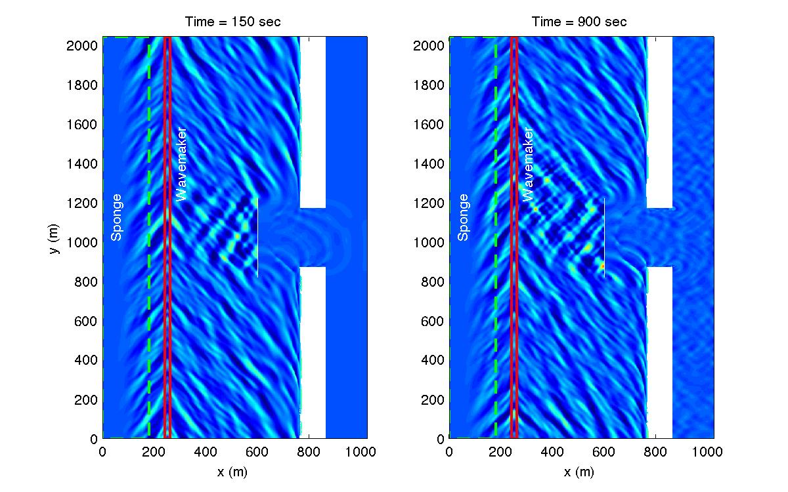

.. _section-inlet-irr30-obs:

30 deg irregular waves and an obstacle
######################################

Continue to build on :ref:`section-inlet-irr30` by adding an obstacle file to the simulation. Refer to :ref:`section-inlet-basics` for domain setup.

 Set descriptive title for your simulation:

 .. code-block:: rest

        !-----TITLE-----
         TITLE = inlet_irr_30deg_obs

 Add an obstacle representative of a breakwater to the :code:`DEPTH` section of "input.txt":

 .. code-block:: rest

        !-----DEPTH-----
         DEPTH_TYPE = DATA
         DEPTH_FILE = ../bathy/dep_shoal_inlet.txt

         OBSTACLE_FILE = ../bathy/obs_shoal_inlet.txt

 "obs_shoal_inlet.txt" has the same format as the depth file, with 1 for water and 0 for obstacle points.

 Refer to :ref:`example_obstacle` for more information.

