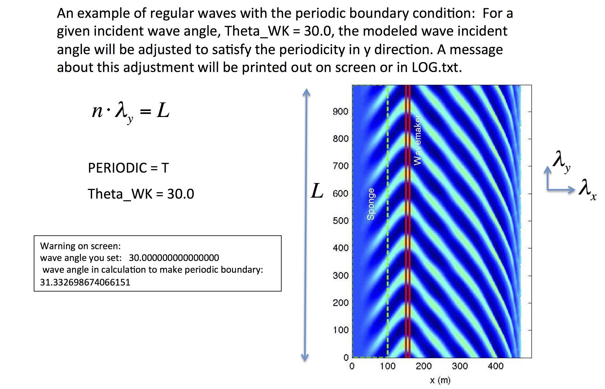

.. _section-periodic:

Periodic Boundary Condition
***************************

**SPECIFICATION OF PERIODIC BOUNDARY CONDITION** 

* :code:`PERIODIC`: logical parameter for periodic boundary condition in the y direction, T - periodic, F - wall boundary condition.

