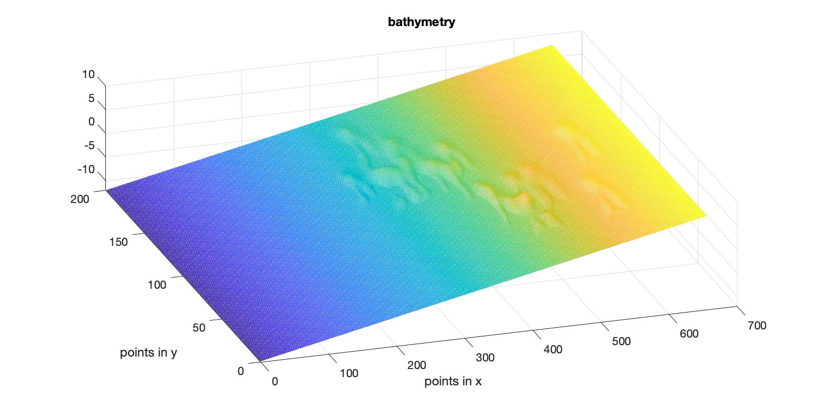
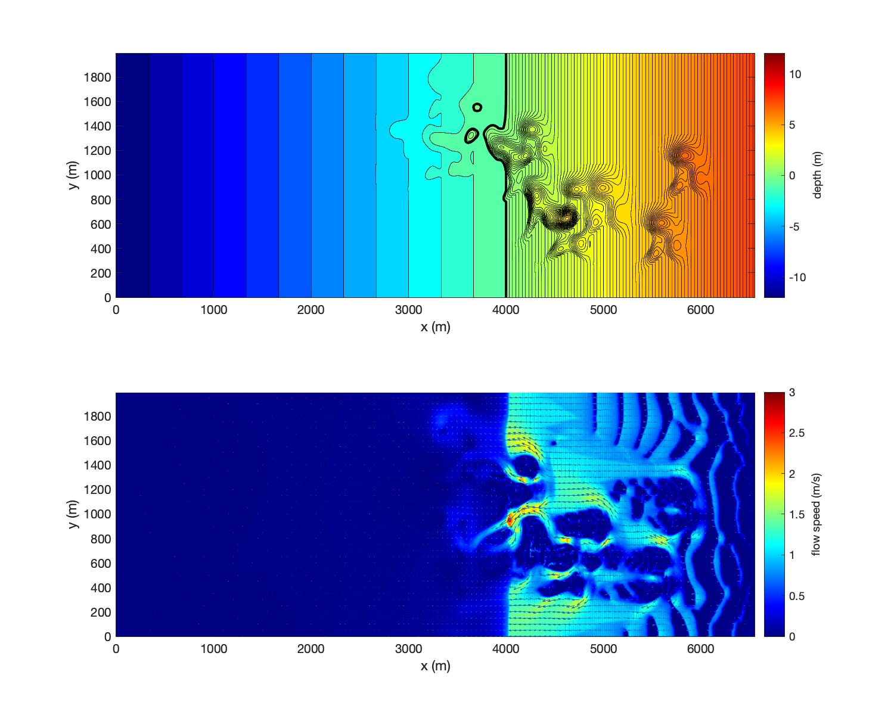

Example
########################################

After compiling with -DPRECIPITATION in Makefile, the program includes the precipitation function. Two simple examples are included in /simple_cases/rain_on_hills/. One is a basic test of precipitation rate to check if rainfall volume is consistent with the precipitation rate specified. It can be tested on a water area with a flat bottom as demonstrated in input\_basic\_test.txt. The other test is an more realistic case which is rainfall on a sloping coastal area with random hills distributed on the slope. The bathymetry/topography data can be generated using mk_1_random_bathy.m. The generated data is shown in the figure on the right. 

The precipitation file is specified in input.txt

.. code-block:: rest

    RAINFALL_FILE = precipitation.txt

precipitation.txt includes

.. code-block:: rest

    dimensions m x n which should cover the entire area of domain
    2 2
    following are time (s) and file names, unit in file is mm/hr
    0.0
    rain_01.txt
    10000.0
    rain_02.txt

In precipitation.txt, the first line is a comment line, informing the dimensions of the data, m x n, which should cover the entire computational domain. In this example, m = 2, n = 2, specified on the second line. The data resolution is automatically calculated based on (m,n) and grid sizes (Mglob,Nglob) specified in input.txt. 

The third line is a comment line. Following the third line, you can specify time, rainfall files sequentially. In the example, time=0.0 s, file=rain\_01.txt, time=10000.0 s, file = rain\_02.txt. When the program read out of data, the model will continue to run with the last data read.

The rainfall file includes the percipitation rate in (m x n). The data will be interpolated into the computational grid automatically. 

.. note :: The unit of percipitation rate is mm/hour. It will converted into m/s automatically by the program. 

Model results can be plotted using plot\_uv.m or movie\_uvz.m as shown in the figure.   

