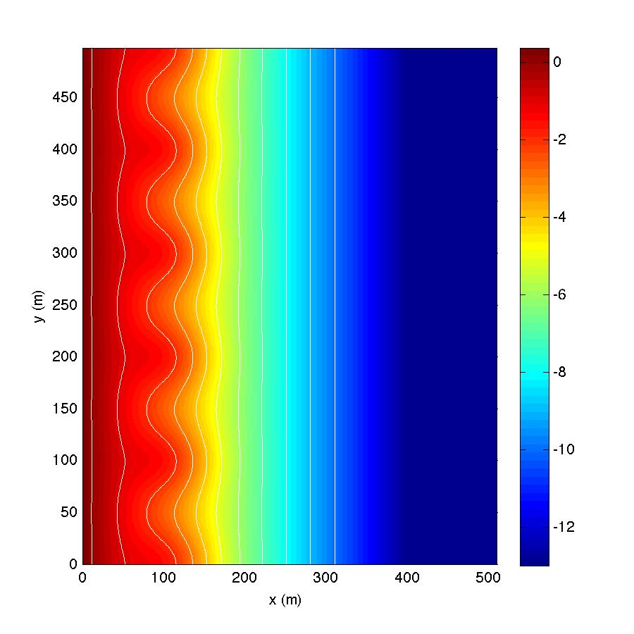

.. _section-rip-basics:

Basics for model setup
######################

In this example, you will use a separate file to define the bathymetry of the computational domain that matches the figure below. In the directory :code:`/simple_cases/rip_2d/bathy/` is a file named "depth_a15.txt" that will be called in "input.txt".

** Computational domain**

**Setup in "input.txt"**

You will find the complete "input.txt" file in the directory :code:`/simple_cases/rip_2d/work/` for this example. On this page, we will focus on setting up the model domain. Wavemaker and physics parameters will be defined on the :ref:`section-rip-irregular` page. **Remember that all parameters are case sensitive**.

 If running in parallel, set the number of processors in X and Y:
 
 .. code-block:: rest
        
        !-----PARALLEL INFO-----
         PX = 4
         PY = 4
         
 Set the bathymetry to the depth file:
 
 .. code-block:: rest
 
        !-----DEPTH-----
         DEPTH_TYPE = DATA
         DEPTH_FILE = ../bathy/depth_a15.txt

(refer to :ref:`definition_grid` for parameter descriptions)

Send the results to a folder named "output":

.. code-block:: rest

        !-----PRINT-----
         RESULT_FOLDER = output/
         
Set the dimensions of the domain to 512 x 250 in x and y directions, respectively:

.. code-block:: rest

        !-----DIMENSION-----
         Mglob = 512
         Nglob = 250
         
Set the total computational time, plot time, and screen intervals to  1000.0 s, 100.0 s, and 100.0 s, respectively. If printing results to a station file, use 0.5 s:

.. code-block:: rest

        !-----TIME-----
         TOTAL_TIME = 1000.0
         PLOT_INTV = 100.0
         SCREEN_INTV = 100.0
         PLOT_INTV_STATION = 0.5
         
Set the grid spacing in x and y to 1.0 m and 2.0 m, respectively:

.. code-block:: rest

        !-----GRID-----
         DX = 1.0 m
         DY = 2.0 m

**Postprocessing**

For postprocessing examples, MATLAB scripts are located in :code:`/simple_cases/rip_2d/postprocessing/`.
