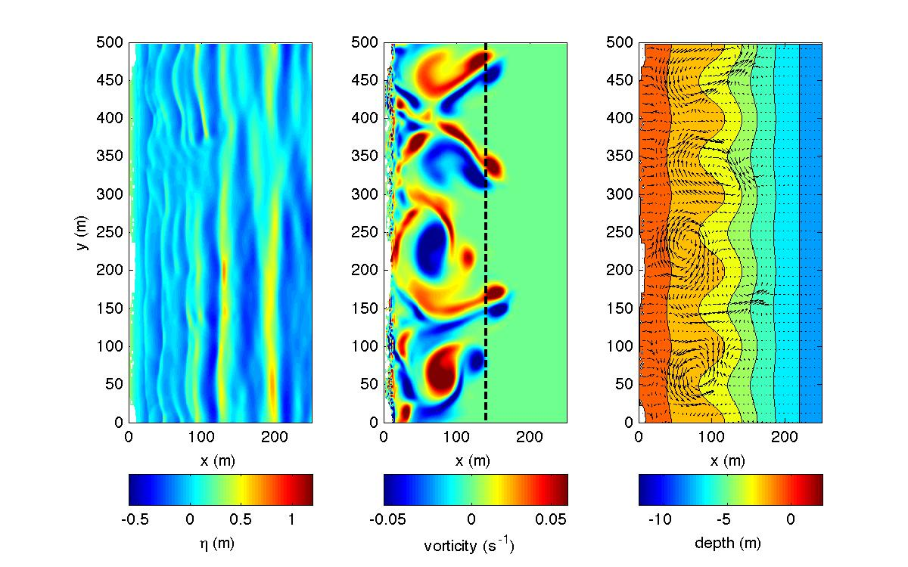

.. _section-rip-irregular:

Irregular wave normal incidence
###############################

Figure: (left) snapshot of surface elevation, (middle) vorticity field, (right) mean current field 

The following sections wil be modified in "input.txt" for this example. The domain setup was defined in :ref:`section-rip-basics`.

 Set a descriptive title for your simulation:
 
  .. code-block:: rest
    
        !-----TITLE-----
         TITLE = rip_2D
         
 Add an irregular wavemaker in a water depth of 13.0 m located 425.0 m from the left boundary with the following characteristics:
 
  .. code-block:: rest
  
        !-----WAVEMAKER-----
         WAVEMAKER = WK_IRR
         DEP_WK = 13.0 
         Xc_WK = 425.0 
         Yc_WK = 0.0 
         FreqPeak = 0.1 
         FreqMin = 0.03
         FreqMax = 0.5 
         Hmo = 1.0 
         GammaTMA = 5.0 
         ThetaPeak = 0.0 
         Sigma_Theta = 10.0 

 (refer to :ref:`definition_wavemaker` for parameter definitions)

 Set the periodic boundary condition to TRUE:
 
  .. code-block:: rest
  
        !-----PERIODIC BOUNDARY CONDITION-----
         PERIODIC = T
         
 Set the sponge layer width to 60 m:
 
  .. code-block:: rest
  
        !-----SPONGE LAYER-----
         DIFFUSION_SPONGE = F 
         FRICTION_SPONGE = T 
         DIRECT_SPONGE = T 
         Csp = 0.0 
         CDsponge = 1.0 
         Sponge_west_width =  0.0 
         Sponge_east_width =  60.0 
         Sponge_south_width = 0.0 
         Sponge_north_width = 0.0 

  (refer to :ref:`info_sponge` for parameter definitions)

 Set the friction coefficient to 0.002:
 
  .. code-block:: rest
  
        !-----PHYSICS-----
         Cd = 0.002
         
 **Keep the default values** for the :code:`NUMERICS`.
 
 Set the minimum depth for wetting and drying to 0.01:
 
  .. code-block:: rest
  
        !-----WET-DRY-----
         MinDepth = 0.01

 Set the viscosity breaking scheme to FALSE:
 
  .. code-block:: rest
  
        !-----BREAKING-----
         VISCOSITY_BREAKING = F

 (refer to :ref:`example_breaking` for parameter definitions)

 Set the wave average parameters to the following:
 
 .. code-block:: rest
 
        !-----WAVE AVERAGE-----
         T_INTV_mean = 50.0 
         STEADY_TIME= 100.0 
 
 Set the following output parameters to TRUE:
 
 .. code-block:: rest
 
        !-----OUTPUT-----
         ETA = T 
         U = T
         V = T
         Umean = T 
         Vmean = T   
         MASK = T 
         WaveHeight = T 

 (refer to :ref:`definition_output` for parameter definitions)

