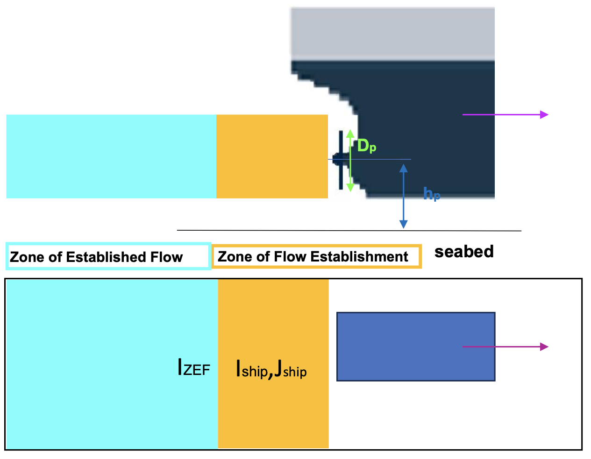

Ship Propeller Effects on Sediment Transport
************************************************

The effects of ship propeller-induced jet flow on sediment transport were presented by Colangeli et al. (2023). 

Efflux velocity
------------------

The efflux velocity generated by a propeller was estimated by the emperical formula (XXX)

.. math:: U_p = V_0 \exp \left( -2 \frac{y^{\prime 2} + h_p^2}{D_p^2} \right) \mbox{  in ZFE: } x^\prime \le \frac{D_p}{2c} 

**References**

Colangeli, C., Leftheriotis, G., Dimas, A., and Brocchini, M., 2023, Ship-forced sediment transport: a new model for the propeller jet flow, The 13th Symposium on River, Coastal, and Estuarine Morphodynamics, RCEM2023, Urbana-Champaign, Sept. 25-28, 2023