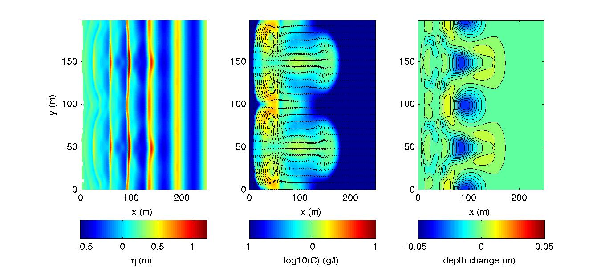

.. _section-rip-sediment:

Sediment Transport in 2D rip channels
#######################################

.. toctree::
   :maxdepth: 2

   sediment_rip_compile
   sediment_rip_info
   sediment_rip_regular