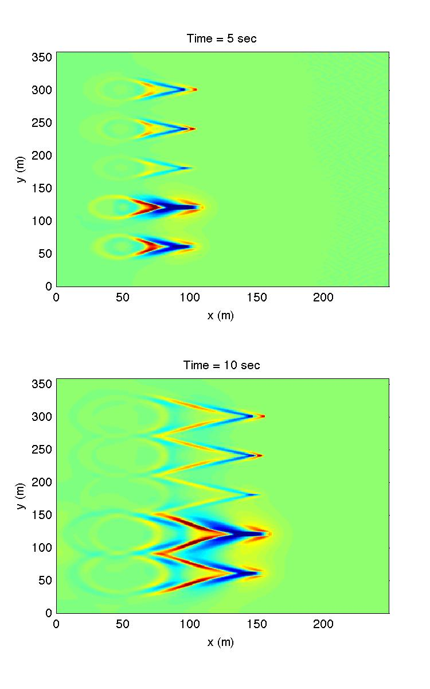
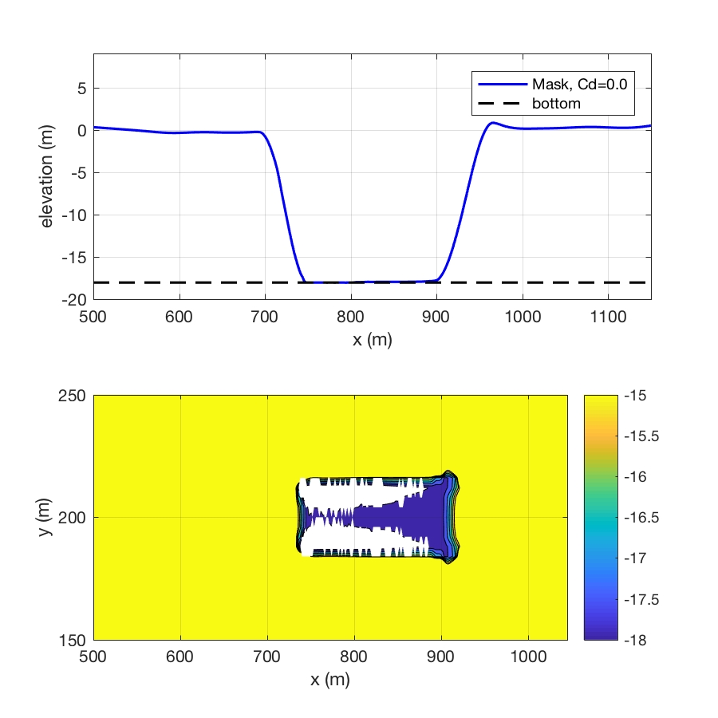

.. _section-shipwakes-setup:

Shipwakes
***************

************************
Ship-wake Model Setup
************************

1) Specify a folder which contains a number of vessel files, :code:`vessel_00001, vessel_00002, ...`
   
   :code:`VESSEL_FOLDER = ./`

2) Specify the number of vessels (e.g., 5)

   :code:`NumVessel = 5`

3) In :code:`vessel_00001`, for example, provide vessel name, vessel type, vessel length, width, shape parameters, draft and time series of vessel path:  

   .. code-block:: rest

        Title: Vessel # 1  - (name)
        PRESSURE, 1  (pressure type, type I)
        Length(m), Width(m), Alpha1, Alpha2, Beta, P(unit) (comment, vessel parameters)
        20.0  10.0, 0.5, 0.5, 1.0    (vessel parameters)
        0.0000000e+00,   5.6000000e+02,   5.0000000e+02  (time, x, y)
        1.0000000e+00,   5.6374897e+02,   5.0255132e+02  (...)
        ...  

   In the time series, the first column is time in seconds, the second and the third are x and y in meters, respectively. 

**The following is an example which includes 5 vessels of different types**

This example can be found in :code:`/simple_cases/vessel_types_compare/`.

Figure: Vessel types (from bottom to top): 1) Pressure Type I, 2) Pressure Type I with large :math:`\alpha`, 3) Pressure Type II, 4) Slender Type I, 5) Slender Type II. 

*vessel_00001: Pressure Type I*

.. code-block:: rest

         Title: Vessel # 1
         PRESSURE, 1
         Length(m), Width(m), Alpha1, Alpha2 Beta, P(m)
         20.0  8.0, 0.0, 0.0, 0.5, 3.0
         Time, X(m), Y(m)  (relative to the origin of the coordinates)
         0.0    50.0  60.0
         100.0 1050.0 60.0

*vessel_00002: Pressure Type I with large* :math:`\alpha`

.. code-block:: rest

         Title: Vessel # 2
         PRESSURE, 1
         Length(m), Width(m), Alpha1, Alpha2, Beta, P(m)
         20.0  8.0, 0.9, 0.9, 0.5, 3.0
         Time, X(m), Y(m)  (relative to the origin of the coordinates)
         0.0    50.0  120.0
         100.0 1050.0 120.0

*vessel_00003: Pressure Type II*

.. code-block:: rest

         Title: Vessel # 3
         PRESSURE, 2
         Length(m), Width(m), a, b, c, P(m)
         10.0  5.0, 16.0, 2.0, 16.0, 2.0
         Time, X(m), Y(m)  (relative to the origin of the coordinates)
         0.0   50.0   180.0
         100.0 1050.0 180.0

*vessel_00004: Slender Type I*

.. code-block:: rest

         Title: Vessel # 4
         SLENDER, 1
         Length(m), Width(m), Alpha1, Alpha2, Beta, F(unit)
         10.0  5.0, 0.0, 0.0, 0.9, 12.0
         Time, X(m), Y(m)  (relative to the origin of the coordinates)
         0.0   50.0   240.0
         100.0 1050.0 240.0

*vessel_00005: Slender Type II*

.. code-block:: rest

         Title: Vessel # 5
         SLENDER, 2
         Length(m), Width(m), Alpha1, Alpha2, Beta, F(unit)
         10.0  5.0, 0.8, 0.8, 0.9, 40.0
         Time, X(m), Y(m)  (relative to the origin of the coordinates)
         0.0   50.0   300.0
         100.0 1050.0 300.0

************************
Deep Draft Vessels
************************

An instability problem may occur in Boussnesq modeling a large-size vessel with a draft close to  channel depth. We developed three methods in the fully nonlinear Boussinesq model, FUNWAVE-TVD, to suppress high-frequency spikes generated near-field of a vessel. The three methods are the shock-capturing method, friction method, and viscosity method, respectively. Tests show that the combined shock-capturing and friction method is the most effective method to suppress the local high-frequency noises, while it does not affect the far-field solution. A strong test, in which the target draft is larger than the channel depth, showed that there are no high-frequency noises generated in the case of ship squat if the shock-capturing method is used.  

**Shock-capturing Method** 
The shock-capturing method is used by switching to SWE solver at the bottom of a vessel. The method is consistent with the shock-capturing-based wave breaking scheme. MASK9 is used to mask the area of the vessel bottom, where SWE is solved. 

**Friction Method**
The Friction Method is one of the dissipation methods used for damping waves as in sponge layers. A large bottom friction is applied locally at the vessel bottom. A proper friction coefficient Cd can be specified by users.  

**Viscosity Method**
The Viscosity Method is also one of the dissipation methods used as in sponge layers. Wave damping rate is usually lower than that in the friction method. 
 
**Model Configuration**

To use one of the three methods or combined methods, the code needs to be recompiled with the flag **-DDEEP_DRAFT_VESSEL** in Makefile. 
The default option (if nothing specified in input.txt) is the combined shock-capturing method and friction method with a friction coefficient of 0.1. This default option and associated parameter were obtained based on the best practice of the tests we have conducted. Users can also specify an option and parameters in input.txt by themselves.

 *Setup of shock capturing method*

  MaskMethod = T 

 *Setup of friction method*

  FrictionMethod = T 
  
  CdDeepDraft = *<floating-point number>*, suggested values: 0.1 -- 1.0

 *Setup of viscosity method*

  ViscosityMethod = T

  VisDeepDraft = *<floating-point number>*, suggested values: 0.1 -- 5.0

**Examples**

The test examples can be found in the github package (master) /simple_cases/vessel_deep_draft/

The figure below shows the result from the strong test in which the target draft is even larger than channel depth. Although the model configuration is not realistic, it can serve as a strong test for numerical instability. Here, a target draft of 20 m versus a channel depth of 18 m was applied. We used the shock-capturing method in the test. The figure shows a large portion of grid cells are dry (white area). The dry points did not cause any high-frequency noises due to the application of the shock-capturing method.

