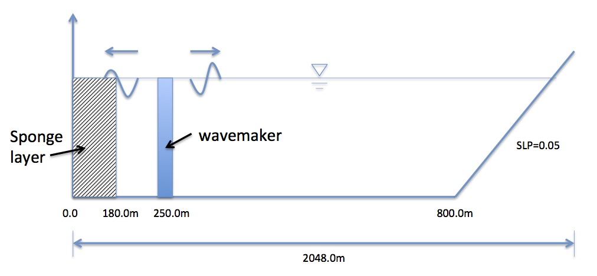

Basics for model setup
##########################

* computational domain

Basic info

 Dimensions 1024 X 3 (at least 3 points in the y direction)

 DX = DY = 1.0 m

 Wavemaker located at x = 250.0 m (for monochromatic or JONSWAP wave cases)

 Sponge layer: x = 0.0 -- 180.0 m

* input.txt
  several input files in the folder /simple_cases/surface_wave_1d/input_files/ for different cases. When run a case, copy one of them to "input.txt"

  input_reg.txt -- monochromatic wave

  input_irr.txt -- JONSWAP spectral waves

  input_solitary.txt -- solitary wave 

* bathymetry is specified in input.txt

  DEPTH_TYPE = SLOPE

  DEPTH_FLAT = 10.0

  SLP = 0.05

  Xslp = 800.0  (for solitary wave case Xslp = 750.0 because of large runup)
  
* postprocessing

  matlab examples of postprocessing are located in /simple_cases/surface_wave_1d/postprocessing/

