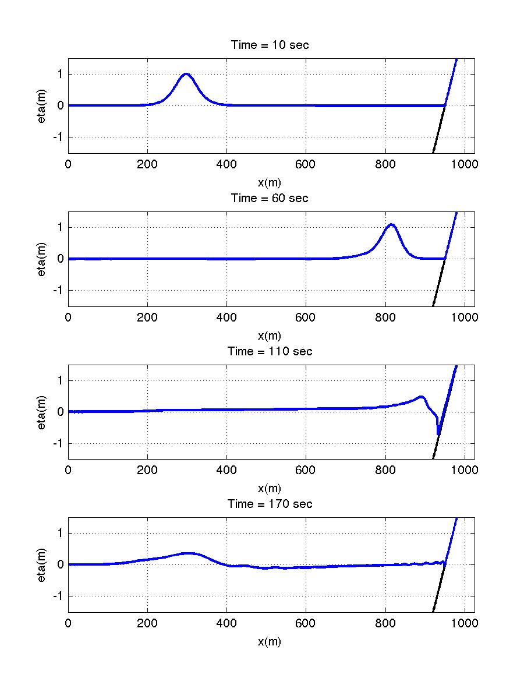

.. _section-1d-solitary:

Solitary wave 
#############

The following sections will be modified in "input.txt" for this case. All other sections are defined in :ref:`section-1d-basics` for this example.

 Set a descriptive title for your simulation:

 .. code-block:: rest

        !-----TITLE-----
         TITLE = solitary_1D

 Add a wavemaker at a water depth of 10 m located 300.0 from the left boundary that produces a solitary wave with initial amplitude 1.0 m:

 .. code-block:: rest

        !-----WAVEMAKER-----
         WAVEMAKER = INI_SOL
         AMP = 1.0
         DEP = 10.0 
         XWAVEMAKER = 300.0 
 
 Note the differences in parameter names for the solitary wave example compared to the Regular and Irregular wave examples. Refer to :ref:`definition_wavemaker` for parameter definitions.
