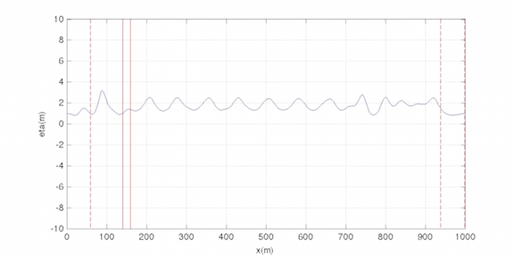

.. _section-tide:

Tide and Surge Boundary Conditions
************************************

**SPECIFICATION OF TIDE AND SURGE OPEN BOUNDARY CONDITIONS** 

* :code:`TIDAL_BC`: logical parameter for tide and surge open boundary conditions, T - tide and surge at open boundaries, F - no tide or surge.

* :code:`TideBcType`: string parameter for data types. Default: TideBcType = CONSTANT

* :code:`TideWest_ETA`: constant eta value at the WEST boundary.

* :code:`TideWest_U`: constant u value at the WEST boundary, defalut: 0.0. 

* :code:`TideWest_V`: constant v value at the WEST boundary, defalut: 0.0. 

* :code:`TideEast_ETA`: constant eta value at the EAST boundary.

* :code:`TideEast_U`: constant u value at the EAST boundary, defalut: 0.0. 

* :code:`TideEast_V`: constant v value at the EAST boundary, defalut: 0.0.

* :code:`TideSouth_ETA`: constant eta value at the SOUTH boundary.

* :code:`TideSouth_U`: constant u value at the SOUTH boundary, defalut: 0.0. 

* :code:`TideSouth_V`: constant v value at the SOUTH boundary, defalut: 0.0.

* :code:`TideNorth_ETA`: constant eta value at the NORTH boundary.

* :code:`TideNorth_U`: constant u value at the NORTH boundary, defalut: 0.0. 

* :code:`TideNorth_V`: constant v value at the NORTH boundary, defalut: 0.0.

IF no ETA values at all four boundaries, Tide and Surge Boundary Condition is invalid.

Example (in input.txt). 

.. code-block:: rest

  ! ---------------- TIDE BOUNDARY ----------------------
    TIDAL_BC = T
    TideBcType = CONSTANT
    TideWest_ETA = 1.0
    TideEast_ETA = 1.0
  ! ----------------WAVEMAKER------------------------------ 
    WAVEMAKER = WK_REG
    DEP_WK = 8.0 
    Xc_WK = 150.0 
    Yc_WK = 0.0 
    Tperiod = 8.0 
    AMP_WK = 0.5 
    Theta_WK = 0.0 
    Delta_WK = 3.0

A simple case is tested in /simple_cases/tide_constant/

This example specifies constant eta=1.0 m at both west and east boundaries. u and v are not specified and will be zero by default. Waves are generated at x=150m. 

 

