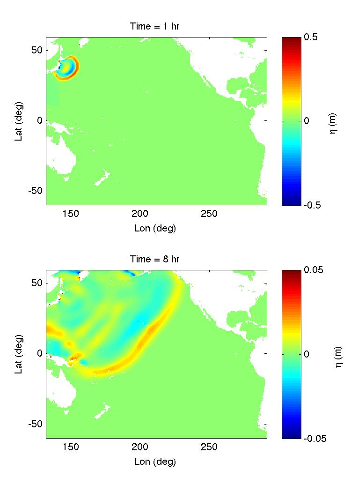

Tohoku Low Resolution 
########################

* Specify bathymetry

  DEPTH_TYPE = DATA

  DEPTH_FILE = ../external_files/depth_30min.txt

* Dimensions

  Mglob = 320

  Nglob = 240

* Grid

  Lon_West = 132.01667

  Lat_South = -59.98333

  Dphi = 0.5

  Dtheta = 0.5

* Add initial conditions

  INI_UVZ = T

  ETA_FILE = ../external_files/ETA_30min.txt

  U_FILE = ../external_files/U_30min.txt

  V_FILE = ../external_files/V_30min.txt

* Add Sponge layers

  SPONGE_ON = T
 
  Sponge_west_width =  100000.0 

  Sponge_east_width =  100000.0

  Sponge_south_width = 100000.0

  Sponge_north_width = 100000.0

* Add friction

  Cd = 0.001

* Avoid inundation in the basin scale

  MinDepth= 10.0

* Output

  ETA = T

  Hmax = T

