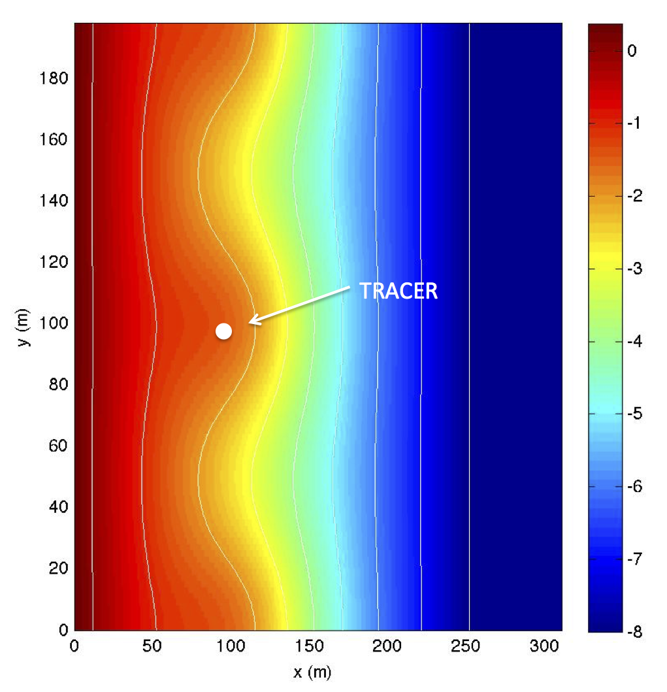

.. _example-rip-tracking:

Lagrangian tracking in 2D rip channels
#######################################

.. toctree::
   :maxdepth: 2

   tracking_rip_compile
   tracking_rip_info
   tracking_rip_regular