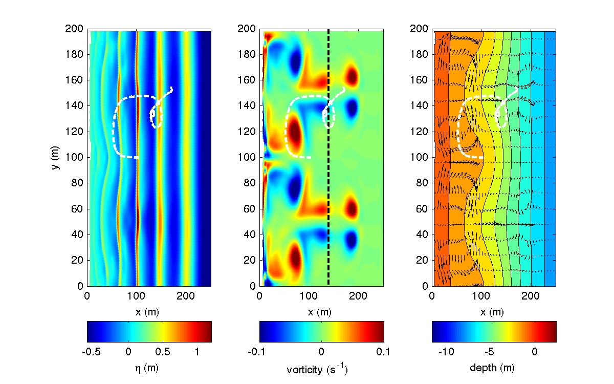

Regular waves with normal incidence
########################################

Figure: (left) snapshot of surface elevation, (middle) vorticity field and (right) current field. The white dashed line represents trajectory. 

 The baseline case of rip current: :ref:`example_rip_current`

**input.txt:**

|  **Parallel(if applicable)**
|   PX = 4
|   PY = 4

|  **Depth**  
|   DEPTH_TYPE = DATA 
|   DEPTH_FILE = ../bathy/depth_a15.txt 

  (refer to :ref:`definition_grid`)

|  **Output folder** 
|   RESULT_FOLDER = output/ 
 
|  **Dimensions**
|   Mglob = 312
|   Nglob = 100 

|  **Time**
|   TOTAL_TIME = 500.0 
|   PLOT_INTV = 100.0 
|   PLOT_INTV_STATION = 0.5 
|   SCREEN_INTV = 100.0 

|  **Wave averaging property** 
|   T_INTV_mean = 50.0 
|   STEADY_TIME= 100.0 

|  **Grid sizes**
|   DX = 1.0 
|   DY = 2.0 

|  **Wavemaker** 
|   WAVEMAKER = WK_REG
|   DEP_WK = 8.0 
|   Xc_WK = 280.0 
|   Tperiod = 8.0 
|   AMP_WK = 0.5 
|   Theta_WK = 0.0 
|   Delta_WK = 3.0 

  (refer to :ref:`definition_wavemaker`)

|  **Sponge layer** 
|   FRICTION_SPONGE = T 
|   DIRECT_SPONGE = T 
|   Csp = 0.0 
|   CDsponge = 1.0 
|   Sponge_west_width =  0.0 
|   Sponge_east_width =  60.0 
|   Sponge_south_width = 0.0 
|   Sponge_north_width = 0.0 

  (refer to :ref:`info_sponge`)

|  **Lateral boundary condition** 
|   PERIODIC = T 

  (refer to :ref:`info_periodic`)

|  **Wetting and drying** 
|   MinDepth=0.01 

|  **Physics** 
|   Cd = 0.002

|  **Breaking scheme**
|   VISCOSITY_BREAKING = F  

  (refer to :ref:`example_breaking`)

|  **TRACKING**
|   TRACER_FILE = tracers.txt

  (refer to :ref:`section-tracer-setup`)

|  **Output** 
|   DEPTH_OUT = T 
|   ETA = T 
|   U = T
|   V = T
|   Umean = T 
|   Vmean = T   
|   MASK = T 
|   WaveHeight = T 

  (refer to :ref:`definition_output`)
