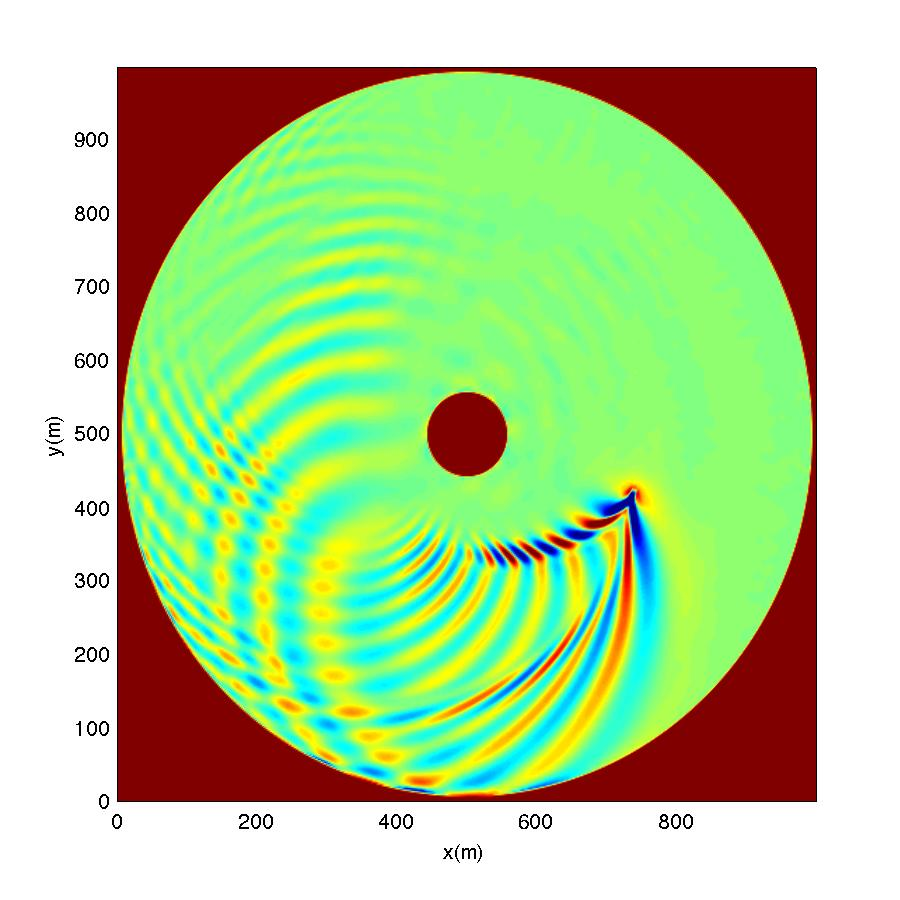

.. _section-vessel-circular:

Single Vessel in a Circular Basin 
#################################

In this example, you will have a single vessel in a circular basin. The input file for this example is located :code:`/simple_cases/vessel_island_beach/`. 

**Computational domain**

.. figure:: images/simple_cases/depth_vessel.jpg
    :width: 400px
    :align: center
    :height: 350px
    :alt: alternate text
    :figclass: align-center

**Setup in input.txt:**

See an example of a complete "input.txt" :ref:`here <section-definitions>`. **Remember that all parameters are case sensitive**.

 Set a descriptive title for your simulation:

 .. code-block:: rest

        !-----TITLE-----
         TITLE = vessel_circular
         
 If running in parallel, set the number of processors in X and Y:

 .. code-block:: rest

        !-----PARALLEL INFO----
         PX = 2
         PY = 2

 Set the bathymetry to the depth file provided:
 
 .. code-block:: rest

        !-----DEPTH-----
         DEPTH_TYPE = DATA
         DEPTH_FILE = depth.txt

 (refer to :ref:`definition_grid` for parameter definitions)

 Send the results to a folder named "output":

 .. code-block:: rest

        !-----PRINT-----
         RESULT_FOLDER = output/

 Set the dimensions of the domain to 500 x 500 (x and y, respectively):

 .. code-block:: rest

        !-----DIMENSION-----
         Mglob = 500
         Nglob = 500

 Set the computational time, plot time, and screen interval to 300.0 s, 1.0 s, and 1.0 s, respectively:

 .. code-block:: rest

        !-----TIME-----
         TOTAL_TIME = 300.0
         PLOT_INTV = 1.0
         SCREEN_INTV = 1.0

 Set the grid spacing in x and y to 2.0 m:

 .. code-block:: rest

        !-----GRID-----
         DX = 2.0
         DY = 2.0
  
 Add a single vessel with the following specifications:

 .. code-block:: rest

        !-----SHIP WAKES-----
         VESSEL_FOLDER = ./
         NumVessel = 1

 In :code:`vessel_00001`, specify:  

  .. code-block:: rest

        Title: Vessel # 1
        Pressure, 1
        Length(m), Width(m), Alpha1(m), Alpha2(m), Beta(m), P(unit)
        20.0  10.0, 0.5, 0.5, 0.5, 1.0
        0.0000000e+00,   5.6000000e+02,   5.0000000e+02
        1.0000000e+00,   5.6374897e+02,   5.0255132e+02
        ...  

 (refer to :ref:`theory_shipwakes` and :ref:`section-shipwakes-setup`)

 Output the water elevation:

 .. code-block:: rest

        !-----OUTPUT-----
         ETA = T

**Postprocessing**

For postprocessing examples, MATLAB and Python scripts are located in :code:`/simple_cases/vessel_island_beach/postprocessing`. An example model result is shown below:

