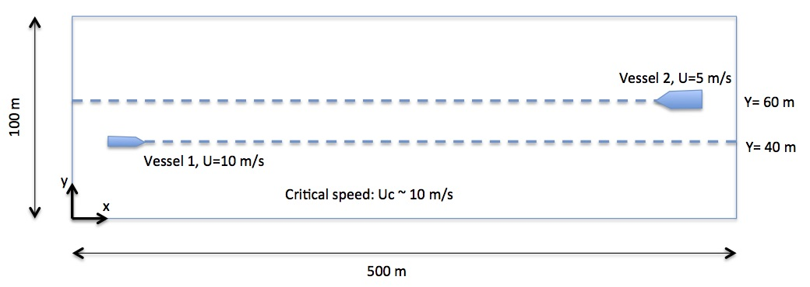
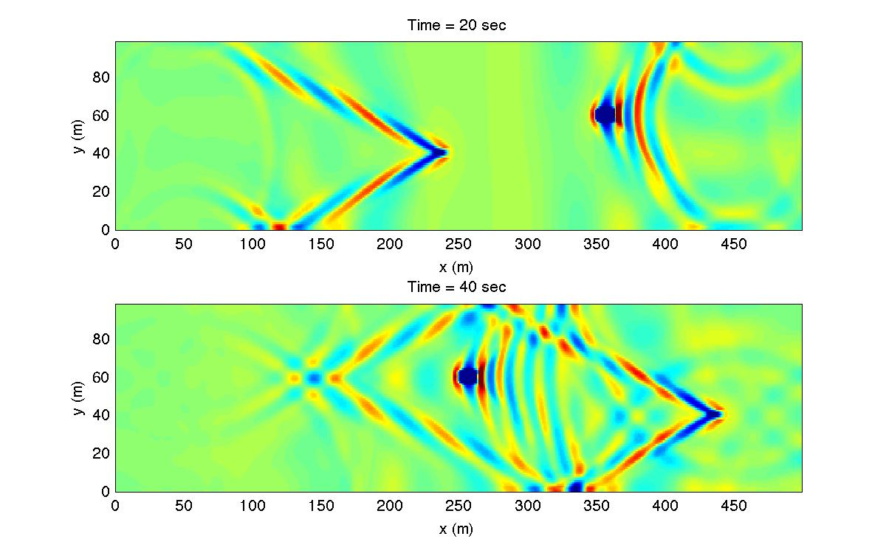

Two vessels with different speeds 
###################################

* Model setup

* input.txt
  is in the folder /simple_cases/vessel_flat_bottom/

**In input.txt:**

|  **Parallel Info (if use parallel)**  
|   PX = 4 
|   PY = 1

|  **Depth**
|   DEPTH_TYPE = FLAT

  DEPTH_FLAT = 10.0

|  **Dimensions**
|   Mglob = 500
|   Nglob = 100

|  **Grid sizes**
|   DX = 1.0
|   DY = 1.0

|  **Set up time**
|   TOTAL_TIME = 50.0
|   PLOT_INTV = 1.0
|   PLOT_INTV_STATION = 50000.0
|   SCREEN_INTV = 1.0

|  **Add vessels**
|   VESSEL_FOLDER = ./
|   NumVessel = 2
| 
|   You need two vessel files: vessel_00001 and vessel_00002 in the current folder. 
|   In vessel_00001, specify:
|   Title: Vessel # 1
|   Blue_Star_I
|   Length(m), Width(m), Alpha(0.5), Beta(0.5), P(draft,m)
|   10.0  5.0, 0.5, 0.5, 2.0
|   Time, X(m), Y(m)  (relative to the orgin of the coordinates)
|   0.0   50.0   40.0
|   100.0 1050.0 40.0
|
|   In vessel_00001, specify:
|   Title: Vessel # 2
|   Blue_Star_II
|   Length(m), Width(m), Alpha(0.5), Beta(0.5), P(draft,m)
|   20.0  8.0, 0.5, 0.5, 3.0
|   Time, X(m), Y(m)  (relative to the orgin of the coordinates)
|   0.0   450.0   60.0
|   100.0 -50.0   60.0

|  **Output**
|   RESULT_FOLDER = output/
|   ETA = T

|  **post-processing**
|   plot_wave_vessel.m in /simple_cases/vessel_flat_bottom/
|   Model result

