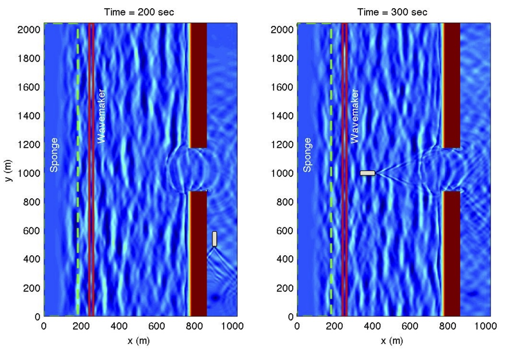

Interaction between wind waves and ship-wakes in an inlet system 
#################################################################

* computational domain

.. figure:: images/simple_cases/ship_inlet_path.jpg
    :width: 250px
    :align: center
    :height: 300px
    :alt: alternate text
    :figclass: align-center

* input_irr_30deg_ship.txt (rename it to input.txt when running the case)
  is in the folder /simple_cases/inlet_shoal/input_files/

* Bathymetry file

  in the folder /simple_cases/simple_cases/inlet_shoal/bathy/dep_shoal_inlet.txt

**model setup is the same as the irregular wave case except:**

|  **add a vessel**
|   VESSEL_FOLDER = ./
|   NumVessel = 1
|
|   In vessel_00001, specify:  
|   Title: Vessel # 1
|   Blue_Star_I
|   Length(m), Width(m), Alpha(m), Beta(m), P(unit)
|   10.0  5.0, 0.5, 0.5, 2.0
|   Time, X(m), Y(m)  (relative to the origin of the coordinates)
|   0.0   900.0   0.0
|   150.0 900.0   0.0
|   250.0 900.0   1000.0
|   1000.0 -6600  1000.0

|  **postprocessing**
|   matlab examples of postprocessing are located in /simple_cases/inlet_shoal/postprocessing/

