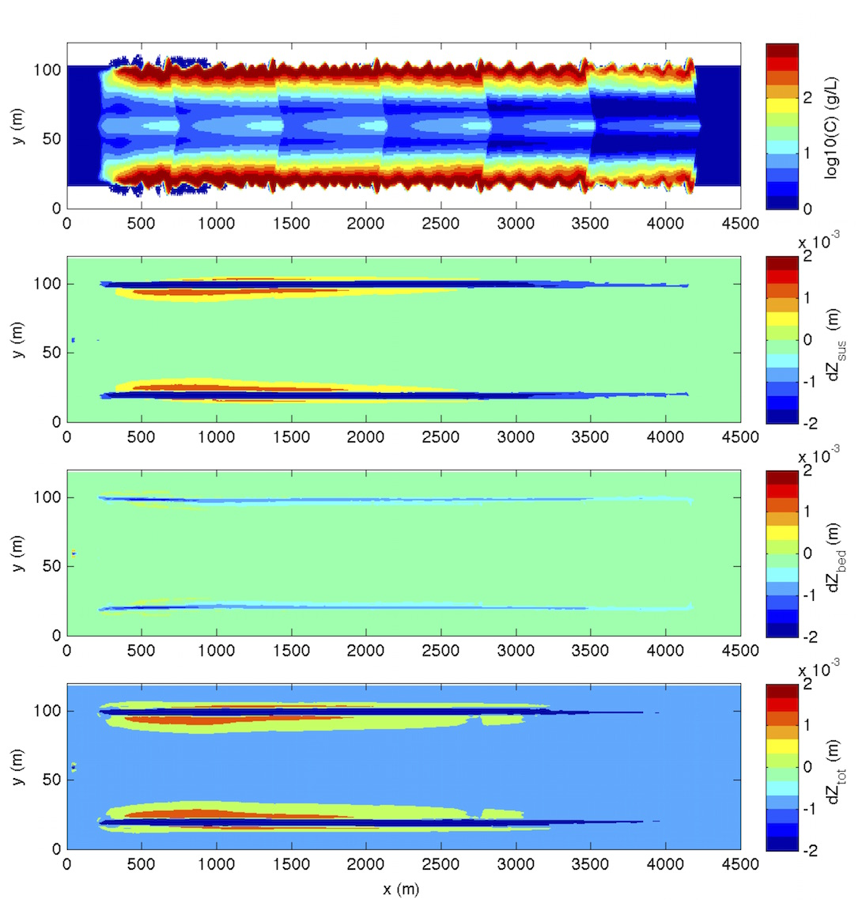

.. _section-vessel-morpho-many:

Multiple vessels-induced morphology changes 
###########################################

In this example, you will add multiple vessels to the vessel-sediment morphology simulation. The primary "input.txt" and corresponding vessel files are located in :code:`/simple_cases/multi_vessel_morphology/`.

**Model setup**

   
**Setup in "input.txt"**

Continue building from the previous two examples (:ref:`section-vessel-morpho-short` and :ref:`section-vessel-sediment-single`) by creating additional vessel files.

 Add up to 6 vessels to the simulation:

 .. code-block:: rest

        !-----SHIP WAKES-----
         VESSEL_FOLDER = ./
         NumVessel = 6

You need 6 vessel files: :code:`vessel_00001, vessel_00002, ...` in the current folder. In :code:`vessel_00001`, specify:

 .. code-block:: rest
        
        Title: Vessel # 1
        Pressure, 1
        Length(m), Width(m), Alpha1(0.5),Alpha2(0.5), Beta(0.5), P(draft,m)
        10.0  5.0, 0.5, 0.5,0.5, 1.5
        Time, X(m), Y(m)  (relative to the orgin of the coordinates)
        0.0   40.0   60.0
        25523.0  180040.0  60.0

 In :code:`vessel_00002`, specify:

 .. code-block:: rest

        Title: Vessel # 2
        Pressure, 1
        Length(m), Width(m), Alpha1(0.5),Alpha2(0.5), Beta(0.5), P(draft,m)
        10.0  5.0, 0.5, 0.5, 0.5, 1.5
        Time, X(m), Y(m)  (relative to the orgin of the coordinates)
        0.0   50.0   60.0
        100.0   50.0   60.0 (release at 100.0 sec from x=50.0 m
        25623.0  180040.0  60.0

 :code:`vessel_00003 - vessel_00006` can be made in the same way. 

 (refer to :ref:`theory_shipwakes` and :ref:`section-shipwakes-setup` for more information)

**Postprocessing**

For postprocessing examples, MATLAB scripts located in :code:`/simple_cases/multi_vessel_morphology/`.

From top to bottom: 1) sediment concentration induced by six vessels; 2) morphological change due to suspended load (not consider porosity); 3) morphological change due to bedload (not consider porosity); and morphological change due to total load.

