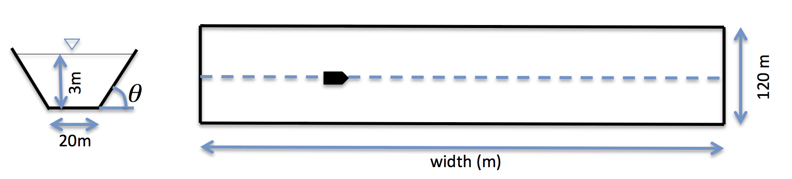
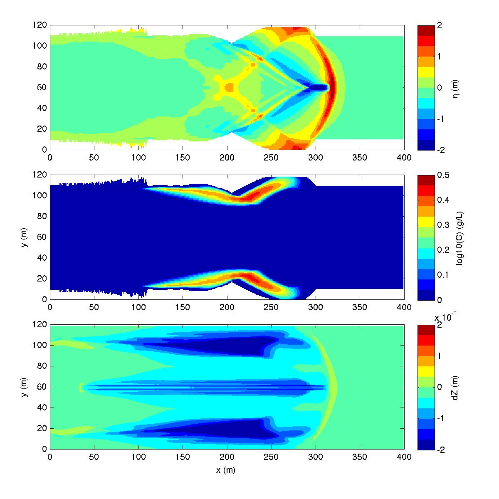

.. _section-vessel-morpho-short:

Single vessel + sediment (small domain for training session)
############################################################

In this example, you will add sediment morphology to a single vessel ship wakes example. The primary "input.txt" and :code:`vessel_00001` files are located in :code:`/simple_cases/single_vessel_short_channel/work/`. 

**Model setup**

NOTE: the simulation is performed in a half domain: y = 0 -- 60 m

**Setup in "input.txt"**

 Set a descriptive title for your simulation:

 .. code-block:: rest

        !-----TITLE-----
         TITLE = vessel_sediment

 If running in parallel, set the number of processors in X and Y:

 .. code-block:: rest

        !-----PARALLEL INFO-----
         PX = 2 
         PY = 1

 Set the bathymetry to the provided depth file; comment out all other depth parameters:

 .. code-block:: rest

        !-----DEPTH-----
         DEPTH_TYPE = DATA
         DEPTH_FILE = ../bathy/depth.txt

 (refer to :ref:`definition_grid` for parameter definitions)

 Send the results to a folder named "output":

 .. code-block:: rest

        !-----PRINT-----
         RESULT_FOLDER = output/

 Set the dimension of the domain to 400 x 60 (x and y directions, respectively):

 .. code-block:: rest

        !-----DIMENSION-----
         Mglob = 400
         Nglob = 60

 Set the computational time, plot time, station printing interval, and screen interval to 60.0 s, 2.0 s, 0.1 s, and 2.0 s, respectively:

 .. code-block:: rest

        !-----TIME-----
         TOTAL_TIME = 60.0
         PLOT_INTV = 2.0
         PLOT_INTV_STATION = 10000.0
         SCREEN_INTV = 2.0

 Set the grid spacing in x and y to 1.0 m:

 .. code-block:: rest

        !-----GRID-----
         DX = 1.0
         DY = 1.0

 Add single vessel with the following characteristics:

 .. code-block:: rest

        !-----SHIP WAKES-----
         VESSEL_FOLDER = ./
         NumVessel = 1

 You need a vessel file :code:`vessel_00001` in the current folder. In :code:`vessel_00001`, specify:

  .. code-block:: rest

        Title: Vessel # 1
        Blue_Star_I
        Length(m), Width(m), Alpha(0.5), Beta(0.5), P(draft,m)
        10.0  5.0, 0.5, 0.5, 1.5
        Time, X(m), Y(m)  (relative to the orgin of the coordinates)
        0.0   40.0   60.0
        25523.0  180040.0  60.0

 (refer to :ref:`theory_shipwakes` and :ref:`section-shipwakes-setup` for more information)

 Set the sponge layer parameters to the following:

 .. code-block:: rest

        !-----SPONGE LAYER-----
         FRICTION_SPONGE = T
         DIRECT_SPONGE = T
         Csp = 0.10
         CDsponge = 10.0
         Sponge_west_width =  0.0
         Sponge_east_width =  0.0
         Sponge_south_width = 0.0
         Sponge_north_width = 0.0
         R_sponge = 0.85
         A_sponge = 5.0
         ETA_LIMITER = F

 Set the following :code:`PHYSICS` and :code:`WET-DRY` parameters to the following:

 .. code-block:: rest

        !-----PHYSICS-----
         VISCOSITY_BREAKING = T
         Cd = 0.0
         CFL = 0.5
         FroudeCap = 10.0

        !-----WET-DRY-----
         MinDepth = 0.02
         Cbrk1 = 0.70
         Cbrk2 = 0.40

 Add :code:`DEPTH_OUT, U, V, ETA,` and :code:`MASK` to the output:

 .. code-block:: rest

        !-----OUTPUT-----
         DEPTH_OUT = T
         U = T
         V = T
         ETA = T
         MASK = T

 Add the sediment morphology parameters:

 .. code-block:: rest

        !-----SEDIMENT-----
         Bed_Change = T
         BedLoad = T
         D50 = 0.0005
         Sdensity = 2.68
         n_porosity = 0.47
         WS = 0.0125
         Shields_cr = 0.055
         Shields_cr_bedload = 0.047
         Tan_phi = 0.7
         Kappa1 = 0.3333
         Kappa2 = 1.0
         MinDepthPickup = 0.1 

 (refer to :ref:`definition_sediment` for sediment parameter definitions)

**Postprocessing**

For postprocessing examples, MATLAB and Python scripts are located in :code:`/simple_cases/single_vessel_short_channel/postprocessing/`. An example model result is shown below:

    (Top) surface elevation, (middle) sediment concentration, (bottom) bed change
