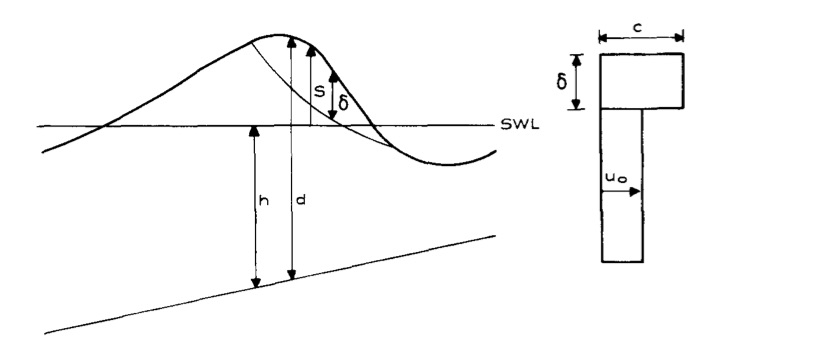

.. _section_wavebreaking:

Wave Breaking, roller and undertow
**************************************

**Breaking schemes**

There are two breaking algorithms implemented in the model. One takes advantage of the shock--capturing scheme in TVD. 
It  follows the approach of Tonelli and Petti (2009),  who successfully used the ability of  NSWE  with a TVD scheme to model moving hydraulic jumps. Thus, the fully nonlinear Boussinesq equations are switched  to NSWE at cells where the Froude number exceeds  a certain threshold. Following Tonelli and Petti, the ratio of wave height to total water depth is chosen as  the criterion to switch from Boussinesq to NSWE, with a threshold value  set to 0.8,  as suggested by Tonelli and Petti. 

The other one is the original eddy--viscosity scheme used in the previous version of FUNWAVE (Kennedy et al., 2000). To fit the eddy--viscosity method in the TVD scheme, the artificial eddy viscosity terms.

.. math:: {\bf R}_{bx} = \frac{\partial }{\partial x} (\nu \frac{\partial P}{\partial x}) + \frac{\partial }{\partial y} (\nu \frac{\partial P}{\partial y} )

.. math:: {\bf R}_{by} = \frac{\partial }{\partial y} (\nu \frac{\partial Q}{\partial y}) + \frac{\partial }{\partial x} (\nu \frac{\partial Q}{\partial x}) 

Note that the form is slightly different from that in Kennedy et al. (2000). The present form was found to give a more stable numerical solution as the cross--derivatives removed. In the present form, :math:`\nu` is the artificial eddy viscosity defined by

.. math:: \nu = B \delta_b^2 (h+\eta) \eta_t

where :math:`\delta_b = 1.2`. In Kennedy et al. (2000), :math:`B` varies smoothly from 0 to 1 so as to avoid an impulsive start of breaking and the resulting instability. In the present TVD model, because there is no instability problem found, we adopt a constant value :math:`B=1` as breaking is initiated

.. math:: B =  1 \ \ \  \eta_t \ge  \eta_t^* 
.. math:: B =  0 \ \ \  \eta_t <  \eta_t^*

The parameter :math:`\eta_t^*` determines the onset and cessation of breaking. Following Kennedy et al., a breaking event begins when :math:`\eta_t` exceeds some initial threshold value :math:`\eta_t^{(I)}`, as breaking develops, the wave will continue to break until :math:`\eta_t` drops below :math:`\eta_t^{(F)}`. However, we do not use the smooth transition as in Kennedy et al. because the present TVD scheme did not encounter any instability problem associated with breaking. The values of :math:`\eta_t^{(I)}` and :math:`\eta_t^{(F)}` can be described by  :math:`C_{brk1}  \sqrt{gh}` and  :math:`C_{brk2} \sqrt{gh}`, respectively, where :math:`C_{brk1}` and  :math:`C_{brk2}` are empirical parameters. In Kennedy et al., :math:`C_{brk1} = 0.65` and  :math:`C_{brk2}=0.15`. Choi et al. (2018) showed that :math:`C_{brk1}` should be smaller and :math:`C_{brk2}` be larger than those in Kennedy et al. to match the laboratory experimental data. For the benchmark test of Vincent and Briggs (1989), for instance, :math:`C_{brk1} = 0.45` and :math:`C_{brk2} = 0.35` were adopted. 

**Roller and undertow**

*Figure 1. Concept of roller (from Schäffer et al., 1993). Cross-section and assumed velocity profile of a breaking wave with a surface roller.*

The general expression of a breaking roller in a Boussinesq-type model was introduced by several authors such as Madsen (1981), Svendsen (1984), and Schäffer et al. (1993):

.. math:: M=u_0d + (c-u_0) \delta,  \ \ \ \ when \ \ breaking
.. math:: M=u_0d, \ \ \ \ \ \ \ \ \ \ else

where :math:`M` is the total momentum flux including the contribution of roller. :math:`u_0` is the velocity defined in the figure, :math:`c` is the wave celerity, and :math:`\delta` is the roller thickness. In FUNWAVE-TVD, we use :math:`u_\alpha` to represent the velocity :math:`u_0`. :math:`c` is calculated using 

.. math:: c = \sqrt{gd}   

which is different from Schäffer et al. (1993) who used the local still water depth: :math:`c=1.3sqrt(gh)`. 

The thickness of roller :math:`\delta` can be estimated using the roller geometry shown in figure 1. However, in the parallelized program, locating the roller region involves cross-core-boundary tracking, that is nontrivial and time-consuming. In FUNWAVE-TVD, we used a rough estimate of the roller thickness based on the correlation between the roller area and the wave height proposed by Svendsen (1984), i.e., 

.. math:: A = 0.9 H^2

where :math:`A` represents the roller area and :math:`H` is the wave height. Based on the roller geometry, the roller area can be estimated as 

.. math:: A = \frac{LH}{2\pi} (1-r)    

where :math:`L` is the wave length and :math:`r` is a ratio representing the thickness and :math:`\delta = rH`. Assuming the wave length can be estimated by :math:`L = 4 H /\tan \theta`, where :math:`\tan \theta` is estimated by :math:`\tan \theta = \eta_t/c`. According to the two formulas above, the ratio :math:`r` can be calculated by

.. math:: r = 1-0.45 \pi \tan \theta 
 
We further assume the local thickness of the roller at the breaking point is :math:`\delta = r (\eta^*-\bar{\eta}`, where :math:`\eta^{*}` and :math:`\bar{\eta}` are the surface elevation at a breaking point and the mean surface elevation, respectively.  The final formula for the roller calculation can be expressed as

.. math:: M=u_0d + (c-u_0) (1-0.45 \pi \tan \theta) (\eta^{*}-\bar{\eta}),  \ \ \ \ when \ \ breaking 

The mean surface elevation is calculated using the time series of surface elevation before the roller estimation. 

The calculation of the undertow uses the local balance of the roller induced momentum flux and the undertow flux. 

**References**

Choi, Y.-K., Shi, F., Malej, M., and Smith, J. M., 2018, "Performance of various shock-capturing-type reconstruction schemes in the Boussinesq wave model, FUNWAVE-TVD", Ocean Modelling, 131, 86-100. `DOI:10.1016/j.ocemod.2018.09.004 <https://doi.org/10.1016/j.ocemod.2018.09.004>`_. 

Kennedy, A.B., Chen, Q., Kirby, J.T., Dalrymple, R.A., 2000. "Boussinesq modeling of wave
transformation, breaking and runup. I: 1D". J. Waterway Port Coastal Ocean Eng. 126
(1), 39–47.

Vincent, C.L., Briggs, M.J., 1989. "Refraction-diffraction of irregular waves over a mound". J. Waterway Port Coastal Ocean Eng. 115 (2), 269–284.

Schäffer H. A., Madsen, P.A., Deigaard, R., 1993, A Boussinesq model for waves breaking in shallow water, Coastal Engineering, https://doi.org/10.1016/0378-3839(93)90001-O

Svendsen, LA., Wave Heights and Set-Up in a Surf Zone, 1984, Coastal Engineering, Vol.
8
  
