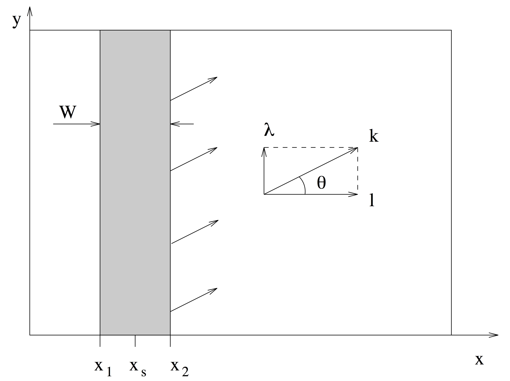

.. _section_wavemaker:

Wave--maker
***********

There are two primary types of numerical wave--makers: Internal and Boundary. In this section, we will discuss internal wave--maker theory.

Internal wave--maker theory
===========================

The internal wavemaker was implemented based on `Wei et al. (1999) <https://www.sciencedirect.com/science/article/pii/S0378383999000095>`_ two--way internal wavemaker and `Chawla and Kirby (2000) <https://www.sciencedirect.com/science/article/pii/S0141118700000055>`_ one--way internal wavemaker (under development). Here, we briefly summarize the formulations used in the wavemakers. Detailed theory can be found in Wei and Kirby (1999) and Chawla and Kirby (2000).    

Wei and Kirby (1999) followed the approach of `Larsen and Dancy (1983) <https://www.sciencedirect.com/science/article/pii/0378383983900224>`_ who used an ad--hoc source mechanism where water mass is added and subtracted along a straight source/sink line inside the computing domain. This approach works well in a staggered--grid differencing scheme, where water is essentially being added to or drained from a single grid block. In applying this technique to the Boussinesq model on an unstaggered grid, however, Wei and Kirby found that use of a single source line accused high frequency noise, leading to blowup of the model. They then used a partially distributed mass source :math:`f(x,y,t)`:

.. math:: f(x,y,t) = g(x) s(y,t)

where :math:`g(x)` is a Gaussian shape function and :math:`s(y,t)` the input time series of the magnitude of source function with an assumption that the center of the source region is parallel to the y--axis. The functions :math:`g(x)` and :math:`s(y,t)` are defined as:

.. math:: g(x) = \mbox{exp}[-\beta(x-x_s)^2]

.. math:: s(y,t) = D \mbox{sin} (\lambda y -\omega t)
 
where :math:`\beta` is the shape coefficient for the source function, and :math:`x_s` is the central location of the source in the :math:`x` direction, for a source oriented parallel to the :math:`y` axis, as shown in the figure below. :math:`D` is the magnitude of the source function, :math:`\lambda = k \mbox{sin} (\theta)` the wavenumber in the :math:`y` direction, and :math:`k` is the linear wavenumber. 

For a monochromatic wave or a single wave component of a random wave train, the magnitude :math:`D` of source function can be determined by:

.. math:: D = \frac{2 a_0 \cos (\theta) (\omega^2 - \alpha_1 g k^4 h^3) }{\omega k I [1-\alpha(kh)^2]}

where :math:`\alpha = -0.390, \alpha_1 = \alpha + 1/3`, and :math:`I` is the integral given by:

.. math:: I = \int^\infty_{-\infty} \exp (-\beta x^2) \exp (-ilx) dx = \sqrt{\frac{\pi}{\beta}} \exp(- l^2/4\beta)

where :math:`l=k\cos (\theta)` is the wavenumber in the :math:`x` direction. In theory, the shape coefficient :math:`\beta` can be any number. The larger the value of :math:`\beta` is, the narrower the source function becomes. The definition of the source function width :math:`W` is not unique, and here we define :math:`W` to be the distance between two coordinates :math:`x_1` and :math:`x_2` where the corresponding source function heights are equal to :math:`\exp (-5) = 0.0067` times the maximum height :math:`D`. Then :math:`x_1` and :math:`x_2` must satisfy the quadratic equation:

.. math:: \beta (x-x_s)^2 = 5

from which the width of source function is given by:

.. math:: W = |x_2 - x_1| = 2\sqrt{\frac{5}{\beta}}

In the previous version of FUNWAVE (`Kirby et al., 1998 <http://resolver.tudelft.nl/uuid:d79bba08-8d35-47e2-b901-881c86985ce4>`_), it is suggested that :math:`W` equals about half of the wavelength for monochromatic wave. If :math:`L` is the wavelength, the requirement of :math:`W=\delta L/2` (where :math:`\delta` is of order 1) results in:

.. math:: \beta = \frac{5}{(\delta L/4)^2} = \frac{80}{\delta^2 L^2}

For random waves, the value of :math:`\beta` is determined according to the peak frequency component and then used for all components in the wave train. FUNWAVE--TVD follows the criteria for determining :math:`\beta`, though a narrow :math:`W` does not seem to cause any problem. 

For the irregular wavemaker, an extension was made to incorporate an  alongshore periodicity into wave generation,  in order to eliminate a boundary effect on wave simulations. The technique exactly follows the strategy in `Chen et al. (2003) <https://agupubs.onlinelibrary.wiley.com/doi/pdf/10.1029/2002JC001308>`_, who adjusted the distribution of wave directions in each frequency bin to obtain alongshore periodicity. This approach is effective in modeling of  breaking wave--induced nearshore circulation such as alongshore currents and rip currents. 

Regular wave generation
-----------------------

The generation of monochromatic wave using the internal wavemaker is straightforward. Following the formulations given in 3.7.1, the magnitude of source function :math:`D` is calculated by Equation 13 shown above for given wave amplitude :math:`a_0`, wave angle :math:`\theta`, water depth :math:`h` and wave period :math:`T=1/2\pi\omega`. The source function can be obtained using the Source function above. 

Irregular wave generation
-------------------------

* Using directional spectral data

Irregular waves can be generated by integrating wave components split by frequency and direction and with random phases. Each wave component contains wave amplitude :math:`a_0` converted from wave energy, wave angle :math:`\theta` and wave period :math:`T`. *The source function for each component can be obtained using the source function.* 

* Using analytical spectrum function

The input for the wavemaker can be wave bulk parameters or directional spectral data. TMA shallow--water spectrum, JONSWAP spectrum and a wrapped--normal directional--spreading function are used to simulate a directional sea state. The combined spectrum function can be expressed as:

.. math:: S(f,h,\theta) = E(f,h) G(\theta)

:math:`E` is the energy density distribution as follows:

.. math:: E (f,h) = \alpha g^2 f^{-5} (2 \pi)^{-4} \Phi (2\pi f, h) e^{-5/4(f/f_p)^{-4}} \gamma^{e^{[-(f/f_p -1)^2 /2\sigma^2]}} 

in which :math:`f_p` is the peak frequency.  :math:`\gamma` presents a frequency spreading parameter, and :math:`\alpha` and :math:`\sigma` are coefficients which may be found in `Bouws et al. (1985) <https://agupubs.onlinelibrary.wiley.com/doi/pdf/10.1029/JC090iC01p00975>`_ :math:`\alpha` is obtained using the input :math:`H_{mo}/H_{sig}`:

.. math:: \sigma = 0.07  \ \ \ \  f \leq f_p 

.. math:: \sigma = 0.09  \ \ \ \  f > f_p

:math:`\Phi` = 1.0 for the JONSWAP spectrum. For TMA, :math:`\Phi` may be expressed as:

.. math:: \Phi (2 \pi f, h) =\frac{1}{2} \omega_h^2 \ \ \ \  \omega_h \leq 1

.. math:: \Phi (2 \pi f, h) = 1-\frac{1}{2}(2-\omega_h)^2 \ \ \ \ 2 > \omega_h >1
.. math:: \Phi (2 \pi f, h) = 1    \ \ \ \  \omega_h \geq 2

where, 

.. math:: \omega_h = 2 \pi f (\frac{h}{g})^{1/2}

Here, :math:`G(\theta)` is the wrapped normal directional spreading function written as:

.. math:: G(\theta) = \frac{1}{2\pi} +\frac{1}{\pi} \sum^N_{n=1} e^{[-\frac{( \sigma_{\theta})^2}{2}]} \cos n\theta 

where :math:`\sigma_{\theta}` denotes circular deviation of the wrapped normal
spreading function. To avoid the computational underflow, :math:`N = 20` in the model.

In the spectral wavemaker, the directional spectrum is first divided into :math:`1000` frequency components and then reconstructed into a user--specified number of components with the equal energy. The directional components are evenly split in each frequency. The source function technique (Wei, et al., 1999) is then used for each component and the final surface elevation function can be written as:

.. math:: \eta = \sum^M_{m=1} C_m \cos \omega _m t + \sum^M_{m=1} S_m \sin \omega _m t

where,

.. math:: C_m  = \sum^k_{n=1} D_{mn} \cos (k_{mn}y + \varepsilon_{mn})

.. math:: S_m =  \sum^k_{n=1} D_{mn} \sin (k_{mn}y + \varepsilon_{mn})

in which y--axis is oriented along the main axis of the wave maker. :math:`D_{mn}, k _{mn}` and :math:`\varepsilon_{mn}` are the amplitude, wave number in the y direction and phase of a component, respectively. The phase can be random. 

The model also provides an option for 1--D spectral wave generation (uni--directional). 

References
==========
Bouws, E., G\ddot{u}nther, H., Rosenthal, W., Vincent, C.L., 1985. "Similarity of the Wind Wave Spectrum in Finite Depth Water: 1. Spectral Form". J. of Geophysical Research, 90, NO. C1, 975-986. DOI: 10.1029/JC090iC01p00975.

Chawla, A., and Kirby, J.T., 2000. "A source function method for generation of waves on currents in Boussinesq models". App. Ocean Research, 22 (2), 75-83. DOI: 10.1016/S0141-1187(00)00005-5.

Chen, Q., Kirby, J.T., Dalrymple, R.A., Shi, F., Thorton, E.B., 2003. "Boussinesq modeling of longshore currents". J. of Geophysical Research, 108, NO. C11, 3362. DOI: 10.1029/2002JC001308

Kirby, J.T., Wei, G., Chen, Q., Kennedy, A.B., Dalrymple, R.A., 1998. "Funwave 1.0: Fully Nonlinear Boussinesq Wave Model -- Documentation and User's Manual". Hydraulic Eng. Reports: NO. CACR-98-06. University of Delaware.

Wei, G., Kirby J.T., Sinha, A., 1999. "Generation of waves in Boussinesq models using a source function method". Coastal Eng. 36 (4), 271-299. DOI: 10.1016/S0378-3839(99)00009-5

