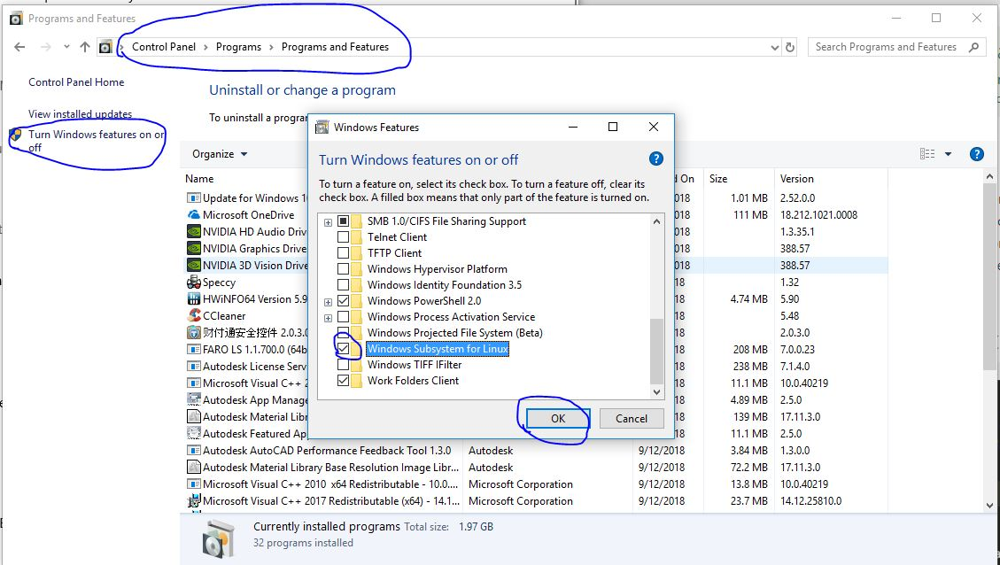

**********************************************************
How to run the model on Windows
**********************************************************

This document is provided by
`Zhouteng Ye <https://zyeeee.com/2019/01/04/compile-funwave-on-windows-10-via-linux-subsystem/>`_

**Preface**

The FUNWAVE code is developed with UNIX based operation systems (Linux and OSX).
It used to be easy to compile With Microsoft Windows, but after the MPI feature was
introduced in FUNWAVE, people found diffculties when compiling with Windows OS.
Now, owing to a new feature of Windows 10, called **Windows Subsystem for Linux**,
the FUNWAVE code can be compiled with Windows 10 without annoying
compling rules for windows. The Linux subsystem allows the users to run Linux command in Windows OS. In some sense, the Linux subsystem is similar to the 
virtual machine approach, but it is much easier and much more power than the
virtual machine in the following aspects:

* fantastic connection between Windows and Linux. You can log in to the Linux subsystem by simply type bash in windows command window, Besides, one can get access and write files to *any* files using the bash commends.

* No limitation of CPU and RAM. Unlike the virtual machine, Linux system can use all CPU and RAM of the PC without any restriction.

**Install Linux Subsystem for Windows 10**

Make sure you have installed Windows 10 and logged in with your Microsoft account.

The first step is to enable the *Developer mode* in windows settings

.. figure:: windows/funwave_img/1.JPG
    :width: 800px
    :align: center
    :height: 500px
    :alt: alternate text
    :figclass: align-center

Then turn on **Windows Subsystem for Linux** in *Control Panel*

Now Download a Linux distribution in *Microsoft Store*. Personally I prefer Ubuntu 16.04 LTS.

.. figure:: windows/funwave_img/3.JPG
    :width: 800px
    :align: center
    :height: 400px
    :alt: alternate text
    :figclass: align-center

After install, you should be able to launch the linux subsystem.

**Get ready with Linux Subsytem**

The first time one launch the Linux subsystem, it takes a couple minutes to initialization. After the initialization, one would be requested to set the username and password. 

.. figure:: windows/funwave_img/5.JPG
    :width: 800px
    :align: center
    :height: 500px
    :alt: alternate text
    :figclass: align-center

type the following commands then you are all set

| sudo apt update
| sudo apt upgrade
| sudo apt install make
| sudo apt install gfortran
| sudo apt install mpich

If you are in China, I would remommend you to change the apt source to the Chinese host. 

**Compile and run FUNWAVE**

To lanch the linux subsystem, you can simply run "bash" in *windows command window*, then you are in the real Linux.

It should be noted that you may not get access to all folder. If so, try to get the permission.

.. figure:: windows/funwave_img/7.JPG
    :width: 800px
    :align: center
    :height: 400px
    :alt: alternate text
    :figclass: align-center

 
With the emaxple *vessel\_flat\_bottom* and set process number as 4, typing 

| make
| mpirun -np 4 ./funwave_vessel

The code will be runing in the linux subsystem. Do not worry about the communication between Linux and Windows, as you can see, as you run the code in Linux, you can get real-time access to the data files generated by the Linux excutive.

.. figure:: windows/funwave_img/8.JPG
    :width: 800px
    :align: center
    :height: 500px
    :alt: alternate text
    :figclass: align-center

