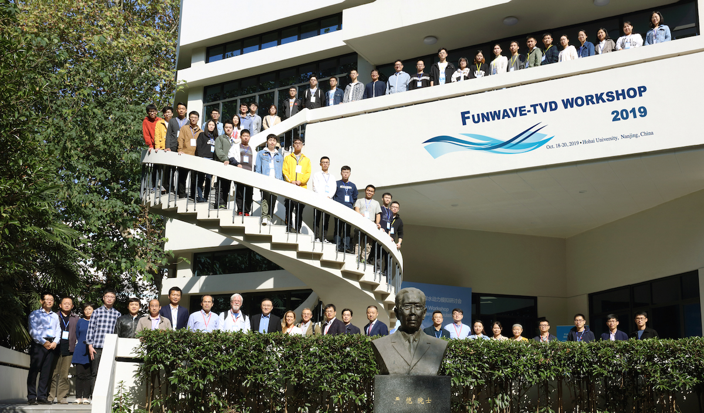

**Front row：** Titi Sui, Chaofeng Tong, Yanqiu Meng, Yue Wang, Zhiqiang Xiong, Xueqing Zhang, Jian Shi, Jinhai Zheng, James Kirby，Fengyan Shi，Annette Grilli，Stephan Grilli，Jisheng Zhang, Chi Zhang, Hongsheng Chen, Weijie Liu, Junliang Gao, Xi Feng, Fangfang Shu, Yumei Ding, Jun Zhu, Xiaowei Zhu, Guoxiang Wu, Hongzhou Chen

**Back row from bottom to top:** Huihua Shen, Zhenjun Zheng, Yanjun Mao, Hui Li, Hongqiao Wu, Zhiling Liao, Weihao Hua, Tinghao Yang, Shujian Zhang, Sai Ge, Chaoqun Ji, Enbo Xing, Yuefeng Wu, Zhilong Wei, Yanyu He, Mengyu Li, Yiyang Zong, Chaofan Lv, Yanshan Chen, Shaodong Wang, Ding Fu, Zhiwei Ding, Xincong Chen, Qing Wang, Zhisong Li, Xingyu Gao, Haiyan Xu, Ying Yu, Meng Luo, Haiming Zhang, Liwei Cao, Yuan Li, Xiangming Cao, Danni Hu, Di Zhang, Yujie Chen, Jinzhen Yu, Jinghua Zhang.

.. _workshop_2019-label:

Workshop 2019
*************

FUNWAVE-TVD Workshop 2019 was held at Hohai University, Nanjing, China, from **18--20 Oct 2019**. This workshop was a joint effort of the Hohai University and the University of Delaware.

There were more than 50 participants from 16 institutes in the workshop.  The three-day workshop included invited talks, technical presentations from community of practicing and experienced users, as well as  hands-on training sessions for new users.   

Participants
*************

 #. Wang Qing -- 	China University Of Geosciences，Wuhan
 #. Zheng Zhenjun -- 	Dalian University of Technology
 #. Mao Yanjun -- 	Dalian University of Technology
 #. Li Hui -- 	Dalian University of Technology
 #. Wu hongqiao -- 	Dalian University of Technology
 #. Sui Titi -- 	Hohai University
 #. Tong Chaofeng -- 	Hohai University
 #. Meng Yanqiu -- 	Hohai University
 #. Shi Jian -- 	Hohai University
 #. Zheng Jinhai -- 	Hohai University
 #. Zhang Jisheng -- 	Hohai University
 #. Zhang Chi -- 	Hohai University
 #. Chen Hongsheng -- 	Hohai University
 #. Feng Xi -- 	Hohai University
 #. Shen Huihua -- 	Hohai University
 #. Hua Weihao -- 	Hohai University
 #. Zhang Shujian -- 	Hohai University
 #. Wei Zhilong -- 	Hohai University
 #. Ding Zhiwei -- 	Hohai University
 #. Chen Xincong -- 	Hohai University
 #. Xu Haiyan -- 	Hohai University
 #. Yu Ying -- 	Hohai University
 #. Luo Meng -- 	Hohai University
 #. Zhang Haiming -- 	Hohai University
 #. Cao Liwei -- 	Hohai University
 #. Li Yuan -- 	Hohai University
 #. Cao Xiangming -- 	Hohai University
 #. Hu Danni -- 	Hohai University
 #. Zhang Di -- 	Hohai University
 #. Gao Junliang -- 	Jiangsu University of Science and Technology
 #. Wang Shaodong -- 	National University of Defense Technology
 #. Chen Hongzhou -- 	Northeast Electric Power University
 #. Zhang Xueqing -- 	Ocean University of China
 #. Wu Guoxiang -- 	Ocean University of China
 #. Chen Yujie -- 	Ocean University of China
 #. Yu Jinzhen -- 	Ocean University of China
 #. Zhang Jinghua -- 	Ocean University of China
 #. Li Zhisong -- 	Shanghai Jiao Tong University
 #. Wang Yue -- 	Shanghai Waterway Engineering Design and Consulting Co., LTD
 #. Xiong Zhiqiang -- 	Shanghai Waterway Engineering Design and Consulting Co., LTD
 #. Zhu Xiaowei -- 	The Pearl River Hydraulic Research Institute
 #. Shu Fangfang -- 	Third Institution of Oceanography, Ministry of Natural Resources
 #. Zhu Jun -- 	Third Institution of Oceanography, Ministry of Natural Resources
 #. He Yanyu -- 	Third Institution of Oceanography, Ministry of Natural Resources
 #. Chen Yanshan -- 	Third Institution of Oceanography, Ministry of Natural Resources
 #. Liao Zhiling -- 	Tianjin University
 #. Yang Tinghao -- 	Tianjin University
 #. Ge Sai -- 	Tianjin University
 #. Ji Chaoqun -- 	Tianjin University
 #. Xing Enbo -- 	Tianjin University
 #. Wu Yuefeng -- 	Tianjin University
 #. Ding Yumei -- 	Tianjin University of Science&Technology
 #. Gao Xingyu -- 	Tsinghua University
 #. Jim Kirby -- 	University of Delaware
 #. Fengyan Shi -- 	University of Delaware
 #. Annette Grilli -- 	University of Rhode Island
 #. Stephan Grilli -- 	University of Rhode Island
 #. Liu Weijie -- 	Zhejiang University
 #. Li Mengyu -- 	Zhejiang University
 #. Zong Yiyang -- 	Zhejiang University
 #. Lv Chaofan -- 	Zhejiang University
 #. Fu Ding -- 	Zhejiang University

Presentations
**************

 .. note:: Click **pdf** to download presentations

* Boussinesq theory and FUNWAVE -- Jim Kirby, `pdf1 <https://drive.google.com/open?id=1xP6nvCGgrmq6u4thSmnuEuyjO3NX2F9z>`_

* Development of FUNWAVE-TVD -- Fengyan Shi, `pdf2 <https://drive.google.com/open?id=1AtNFbhlO_QmV_bFGbjK6sGxniUMQQmyI>`_

* Tsunami applications of FUNWAVE: Methedology -- Stephen Grilli

* Tsunami applications of FUNWAVE: Case studies -- Stephen Grilli

* Multi-grid nesting interface for FUNWAVE-TVD -- YoungKwang Choi, `pdf3 <https://drive.google.com/open?id=14Yda-HAAdeiCKZBN51at-GMkDhz4S1uB>`_

* Analytical and numerical investigation of trapped ocean waves along a submerged ridges -- Gang Wang, `pdf4 <https://drive.google.com/open?id=1db3ME9mCTRGsDZRC3g46AUP7KIrrL5E9>`_

* Approaches to morphology modeling in FUNWAVE -- Jim Kirby, `pdf5 <https://drive.google.com/open?id=1xP6nvCGgrmq6u4thSmnuEuyjO3NX2F9z>`_

* FUNWAVE modeling beach erosion during Typhoon Hato in Zhuhai, China -- Jun Zhu, `pdf6 <https://drive.google.com/open?id=1bkPhJC6EfmRjcOdTyNBbfLG5fPl8AI4o>`_

* Assessing extreme storms risk on coastal communities using FUNWAVE. A case study in Rhode Island, USA -- Annette Grilli

* Applications of FUNWAVE to investigation of harbor oscillations -- Junliang Gao, `pdf7 <https://drive.google.com/open?id=127aoKX-2JO0MScinWjd7vifha9qyZtFf>`_

`Back to funwave-tvd page <https://fengyanshi.github.io/build/html/index.html>`_
----------------------------------------------------------------------------------
