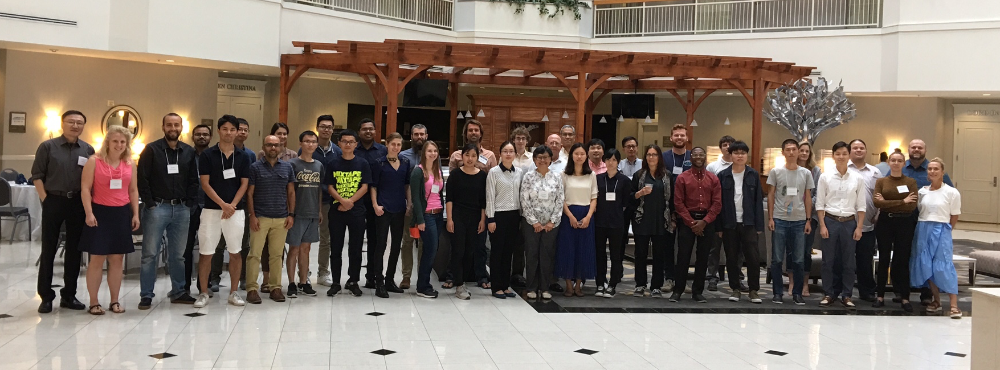

*********************************************
FUNWAVE-TVD Workshop 2019
*********************************************

We are pleased to announce that FUNWAVE-TVD Workshop 2019 will be held at the University of Delaware, Newark, DE from **25--27 July 2019**. This workshop is organized by the Center for Applied Coastal Research (CACR). The workshop is open to all FUNWAVE users and interested parties.

This workshop will focus on some new features added to the model recently, such as ship-wake generation, sediment transport, and model coupling and nesting framework. It will also cover general topics, such as the modeling of nearshore surface waves and processes such as harbor resonance, nearshore wave transformation, refraction and diffraction with complex geometries, nearshore circulation, and tsunami propagation and inundation from ocean basin- to nearshore-scales.

The three-day workshop will include hands-on training sessions for new users, as well as technical talks from community of practicing and experienced users.

More details will follow shortly regarding registration and accommodations. Information about FUNWAVE-TVD can be found at https://fengyanshi.github.io/build/html/index.html

Any questions can be directed to Fengyan Shi at fyshi@udel.edu, (302) 831 2449, or Christine Murray at camurray@udel.edu, (302) 831 2442. 

NOTE: the registration will be capped at 30 participants.

`Back to FUNWAVE-TVD Page <https://fengyanshi.github.io/build/html/index.html>`_

