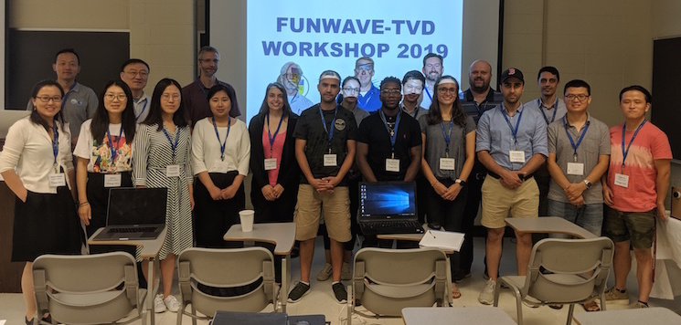

*********************************************
MINI-FUNWAVE-TVD Workshop 2019
*********************************************

MINI-FUNWAVE-TVD Workshop 2019 will be held at the University of Delaware, Newark, DE on **15--16 July 2019**. This workshop is informal, and it will focus on training and discussions about general FUNWAVE model applications.

**Tutorial**

* Download the tutorial, `pdf1 <https://drive.google.com/open?id=1nW0DWoTJXpy1vOQ0DFtcAoUOD54bqB7O>`_

**Attendees**

* Aiken, Rebecca, Stantec 
* Chen, Yujie, UD 
* Chambers, Rachel, Stantec 
* Forlini, Carola, UFL
* Haas, Kevin, GATECH 
* Jefferson, Joe, UFL
* Kerr, Corbitt, Stantec
* Kirby, Jim, UD 
* Li, Mengyu, UD 
* Malej, Matt, USACE  
* Muller, Mark, Salisbury Univ. 
* Salatin, Reza, Northeastern University 
* Shi, Fengyan, UD 
* Wei, Zhangping, Michael Baker International
* Marsooli, Reza, Stevens Inst. of Tech.
* Muscalus, Alex, GATECH
* Qayyum, Rizwan, UFL
* Ye, Zhouteng, UD 
* Yuan, Ye, UD 
* Zhang, Jinghua, UD
* Zhang, Yu, UD
* Zhu, Jun, Third Institute of Oceanography, Xiamen

`Back to FUNWAVE-TVD Page <https://fengyanshi.github.io/build/html/index.html>`_

