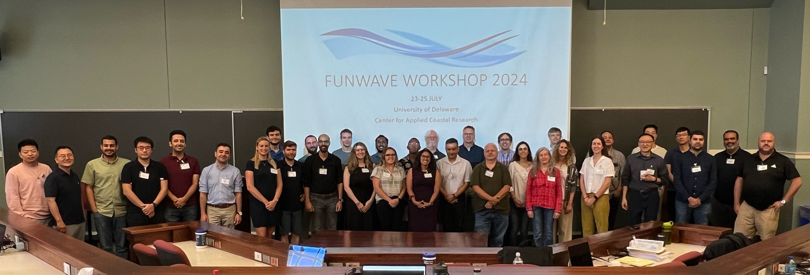
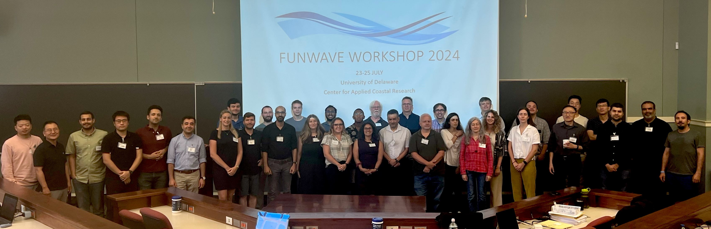

.. _workshop24:

Workshop 2024
==============

We are pleased to share the information about the FUNWAVE-TVD 2024 Training Workshop held on July 23-25, 2024, at the University of Delaware, Newark, DE.  This workshop is organized by the Center for Applied Coastal Research (CACR), University of Delaware, and the US Army Engineer Research and Development Center (ERDC). The workshop is open to all FUNWAVE users and interested parties.

This workshop covered general topics, including the modeling of nearshore surface waves and processes such as harbor resonance, nearshore wave transformation, refraction and diffraction with complex geometries, non-coherent internal wavemaker, nearshore circulation, and tsunami propagation and inundation from ocean basin- to nearshore-scales. It also introduced some new features added to the model recently, such as varying water level boundary condition in a tide/surge module, sub-gridding, and bubble/foam. The three-day workshop included hands-on training sessions for new users, as well as technical talks from the community of practice and experienced users.

.

`Agenda <agenda_2024.html>`_

`Tutorial <https://drive.google.com/file/d/1262jUZ4lxUxt4CrvewfQ0k1Eih2-JQlk/view?usp=drive_link>`_

**Presentations**

 * `Jim Kirby (UD): Finite difference calculations of weakly and fully-nonlinear wave shoaling and breaking <https://drive.google.com/file/d/1kOQVM6dNo-84Vk4fq-VkiOMUYetBDF_6/view?usp=drive_link>`_
 * `Fengyan Shi (UD): FUNWAVE-TVD update <https://drive.google.com/file/d/1JdaKwN0CgbKG8mCqfbdXEd16JVuvGolG/view?usp=drive_link>`_
 * `Matt Malej (USACE): Model development and applications for the US Army Corps of Engineers <https://drive.google.com/file/d/1Qmj2Vu3wqOJwlNZ8Kwco8er1bcn4a8w6/view?usp=drive_link>`_
 * `Jim Chen (NEU): Detecting wave coherence based on observation of alongshore swash variation <https://drive.google.com/file/d/1D48iG2gONtOzASz0Z6d8aftWUkWi3SVs/view?usp=drive_link>`_
 * `Ryan Schanta (UD), Predicting Nonlinear Wave Properties using Convolutional Neural Networks Trained on FUNWAVE Outputs <https://drive.google.com/file/d/1mPvKzRf-Skrqz9xmNv63bdACvvia0AEs/view?usp=drive_link>`_
 * Yashar Rafati (HDR), FUNWAVE Modeling for the Design of Harbors and Coastal Infrastructure in the US Southwest
 * `Chris Malone (UD/Moffatt Nichol), Simulation of tsunami-induced sediment transport and coastal morphology change <https://drive.google.com/file/d/150KC22xT1DQhc_p7ZHdsSHItgwA6h2YG/view?usp=drive_link>`_
 * Said Parlad (UNIVPM, Italy), Reconstruction of Nearshore Wave Propagation by Combining Remote Sensing Tools and Model Chain
 * `Danial Golbaz (UD), Rain impacts on wave dynamics: the precipitation module in FUNWAVE-TVD <https://drive.google.com/file/d/1lVu2r5gL9T-ONvMgBlVvWLalNzKyhhQn/view?usp=drive_link>`_
 * Zaid Abdallah Khalil AL Husban (UD), Modeling the effects of Nor’easters on southern Delaware Bay shoreline
 * `Michael Lam (ERDC/CHL), Ship-induced Waves and Assessment of Erosion/Scour Hotspots and Potential Impacts to Hurricane-Flood Protection System in SNWW (Houston-Galveston) <https://drive.google.com/file/d/1VxVnkzbN7wbVDuTnncWx_hmEhIC5nQ7X/view?usp=drive_link>`_
 * `Marissa Torres (ERDC/CRREL), Leveraging FUNWAVE for natural and nature-based features applications <https://drive.google.com/file/d/15WkIkaR79uXUxMb6va4XbhjpFuciO1qM/view?usp=drive_link>`_

**Training sessions**

 * `Training session 1 <https://drive.google.com/file/d/1Ja0QG35XswyPcKRENK6VUNQk0B_N8ZqW/view?usp=drive_link>`_
 * `Training session 2 <https://drive.google.com/file/d/1W6Q6AF0fVybOXHdJGxrP-PaYof9UHyn5/view?usp=drive_link>`_
 * `Training session 3 <https://drive.google.com/file/d/1gOj6tm7qNpHK8F9uwww_e6v2mvJoYDuS/view?usp=drive_link>`_
 * `Training session 4 <https://drive.google.com/file/d/1MFEpxTZlhvxdSS0k-LsYUtCm19Rsl_rW/view?usp=drive_link>`_

`Back to funwave-tvd page <https://fengyanshi.github.io/build/html/index.html>`_